# Session 20: Monitoring, Observability and GitOps

**Name:** Vansh Dobhal | **Roll No:** 10099

This session covers three tasks on one shared minikube cluster (single node, Kubernetes v1.37, 8 CPU / 7 GB):

| Task | What I built and ran | Namespace(s) |
|------|----------------------|--------------|
| Task 1: Monitoring | kube-prometheus-stack (Prometheus, Alertmanager, Grafana, kube-state-metrics, node-exporter) via Helm, a Flask app that exposes `/metrics`, a ServiceMonitor, a PrometheusRule with 4 alerts, PromQL queries for CPU, memory, `up` and request counters, an alert that fired and then resolved, logs, probes and API-server health | `monitoring`, `s20-app` |
| Task 2: Observability | Notes on metrics, logs and traces, plus a small working trace demo: the same Flask app sends OpenTelemetry spans to Jaeger v2 | `s20-app` |
| Task 3: GitOps | Argo CD installed from the official manifest. An Application syncs the instructor's public repo, and I show Synced/Healthy status, self-heal, drift detection with `argocd app diff`, and Git history as the source of truth. My own `gitops/` manifests and Application point at `v4xsh/devops-homework` | `argocd`, `s20-app` |

All terminal screenshots (`screenshots/*.png`) were made with the `snap` tool. It runs the commands for real and saves the exact text in `outputs/*.txt`. All UI screenshots (`screenshots/browser/*.png`) are real captures of the live web UIs (Prometheus, Alertmanager, Grafana, Jaeger, Argo CD). I took them with headless Chromium (Playwright) through `kubectl port-forward`, using `scripts/browser_shot.py`.

---

## Folder structure

```
session-20-monitoring-observability-gitops
├── README.md
├── scripts/                       # every command I ran, in order (01 ... 08)
│   ├── port-forwards.sh           # keeps port-forwards alive: 19090 Prometheus, 19093 Alertmanager, 13000 Grafana, 16686 Jaeger, 18443 Argo CD
│   ├── promq.sh                   # tiny curl+jq wrapper around /api/v1/query
│   └── browser_shot.py            # headless Chromium screenshot of a real UI page
├── task1-monitoring
│   ├── helm-values/kube-prometheus-stack-values.yaml   # slim values (6h retention, small requests)
│   ├── sample-app/{app.py, Dockerfile, requirements.txt} # Flask + prometheus_client + OpenTelemetry
│   ├── k8s/app.yaml               # Namespace, Deployment (probes, resources), Service
│   ├── k8s/loadgen.yaml           # busybox traffic generator (about 8 req/s, ~8% are HTTP 500)
│   ├── k8s/servicemonitor.yaml    # scrape config for the Prometheus Operator
│   ├── k8s/prometheusrule.yaml    # AppDown, AppHighErrorRate, HighPodRestarts, AppHighCPU
│   └── grafana/dashboard-configmap.yaml  # dashboard loaded by the Grafana sidecar
├── task2-observability/otel-jaeger/jaeger.yaml          # Jaeger v2 (OTLP receiver + UI)
├── task3-gitops
│   ├── argocd/application-instructor-repo.yaml   # live demo (public instructor repo)
│   ├── argocd/application-devops-homework.yaml   # my repo, to apply after pushing
│   └── gitops/s20-metrics-app/                   # my declarative app manifests (what Argo CD will own)
├── screenshots/   (terminal PNGs + browser/ UI captures)
└── outputs/       (exact text of every terminal screenshot)
```

---

## Task 1: Monitoring

### 1.1 Install kube-prometheus-stack with slim values

The cluster is shared with other workloads, so `kube-prometheus-stack-values.yaml` keeps the stack small:

* `kubeEtcd`, `kubeControllerManager`, `kubeScheduler` and `kubeProxy` scraping are disabled. These endpoints are not reachable on minikube and would only show as DOWN targets. Their default rules are disabled for the same reason.
* Prometheus: `retention: 6h`, `retentionSize: 1GB`, requests of 100m CPU / 384Mi.
* Every `*SelectorNilUsesHelmValues: false`. Without this, Prometheus only picks up ServiceMonitors and rules that carry the Helm release label. With it, my ServiceMonitor and PrometheusRule in `s20-app` are discovered.
* Grafana: dashboard sidecar with `searchNamespace: ALL`, so any ConfigMap labelled `grafana_dashboard: "1"` becomes a dashboard.

```bash
helm upgrade --install kps prometheus-community/kube-prometheus-stack \
  -n monitoring --create-namespace -f task1-monitoring/helm-values/kube-prometheus-stack-values.yaml --wait
```

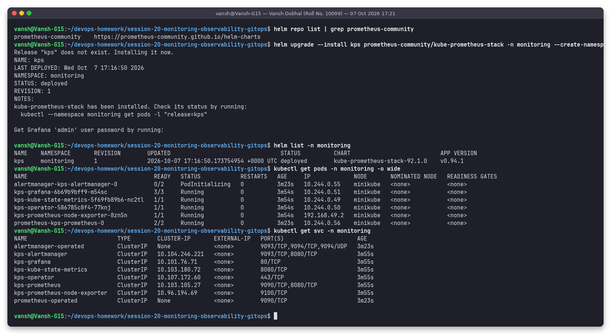

### 1.2 Sample application with a `/metrics` endpoint

`task1-monitoring/sample-app/app.py` is a small Flask service. Gunicorn runs it as non-root UID 10001. It exposes:

| Endpoint | Purpose |
|----------|---------|
| `/` | app info |
| `/work` | burns some CPU and sleeps 10–50 ms (simulates a downstream call) |
| `/error` | always returns HTTP 500 and logs an ERROR line |
| `/healthz` | liveness probe |
| `/readyz` | readiness probe |
| `/metrics` | Prometheus exposition format |

The app defines these metrics with `prometheus_client`:

* `app_requests_total{method,endpoint,status}`: a **counter**
* `app_request_duration_seconds{endpoint}`: a **histogram** (used for p95 latency)
* `app_requests_in_progress`: a **gauge**
* `app_info{version}`: build info

I built the image and loaded it into minikube (no registry needed):

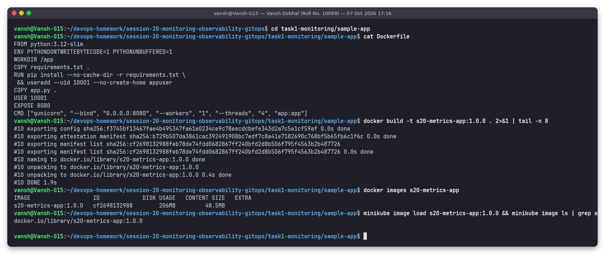

Next I deployed the app (2 replicas with liveness and readiness probes and requests/limits), Jaeger, the ServiceMonitor, the PrometheusRule and the dashboard ConfigMap:

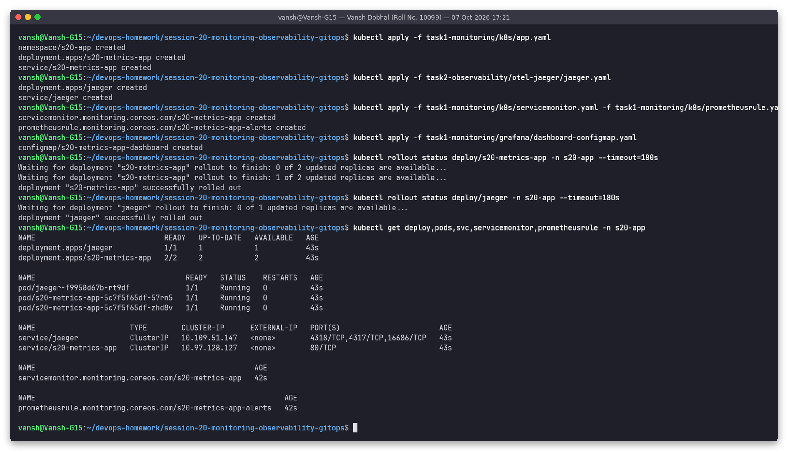

The loadgen Deployment (`k8s/loadgen.yaml`) sends real traffic. Here is the raw `/metrics` output:

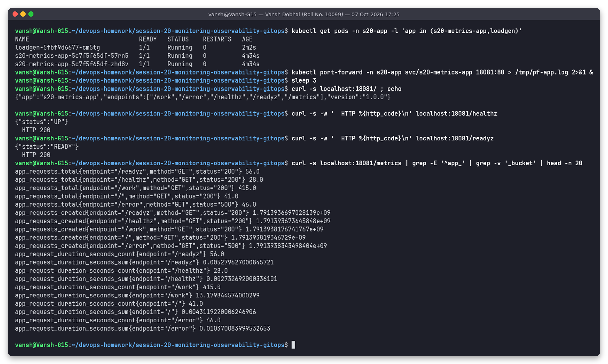

### 1.3 Prometheus scrapes the app (ServiceMonitor)

```yaml
# task1-monitoring/k8s/servicemonitor.yaml (excerpt)
spec:
  selector: {matchLabels: {app: s20-metrics-app}}
  endpoints:
    - port: http
      path: /metrics
      interval: 15s
      honorLabels: true
```

`/api/v1/targets` shows both app pods as `up`, next to the cluster components:

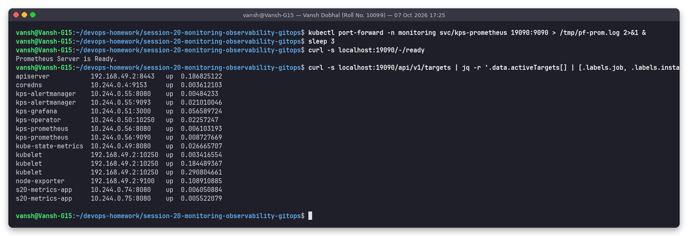

The same targets in the real Prometheus UI:

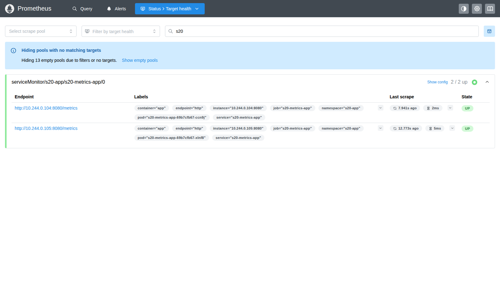

### 1.4 CPU and memory utilisation (PromQL through the HTTP API)

Prometheus was port-forwarded to `localhost:19090`, and every query went through `curl` to `/api/v1/query`. The first query is shown as a raw curl. The rest use `scripts/promq.sh`, which is the same curl plus a `jq` formatter.

| Question | PromQL |
|----------|--------|
| CPU cores used per pod | `sum by (pod) (rate(container_cpu_usage_seconds_total{namespace="s20-app",container!=""}[2m]))` |
| Memory working set per pod (MiB) | `sum by (pod) (container_memory_working_set_bytes{namespace="s20-app",container!=""}) / 1024 / 1024` |
| Busiest namespaces | `topk(5, sum by (namespace) (rate(container_cpu_usage_seconds_total{container!=""}[5m])))` |
| Node CPU % | `100 * (1 - avg(rate(node_cpu_seconds_total{mode="idle"}[5m])))` |
| Node memory % | `100 * (1 - node_memory_MemAvailable_bytes / node_memory_MemTotal_bytes)` |

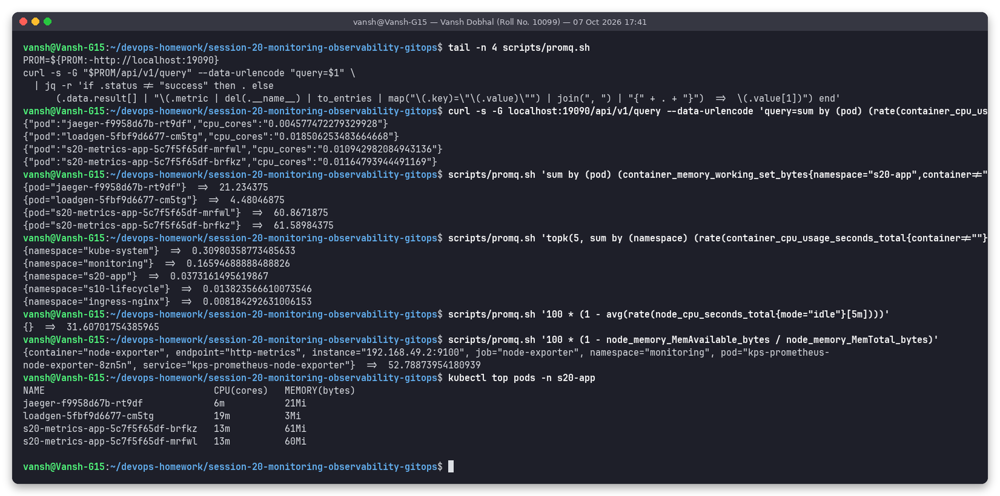

Each app pod used about 0.011 cores and about 61 MiB. `kubectl top` (metrics-server) reports the same numbers (13m CPU, 60–61Mi), so the two sources agree. The node was at about 32% CPU and 53% memory, because other workloads also run on this cluster.

The CPU graph in the Prometheus UI:

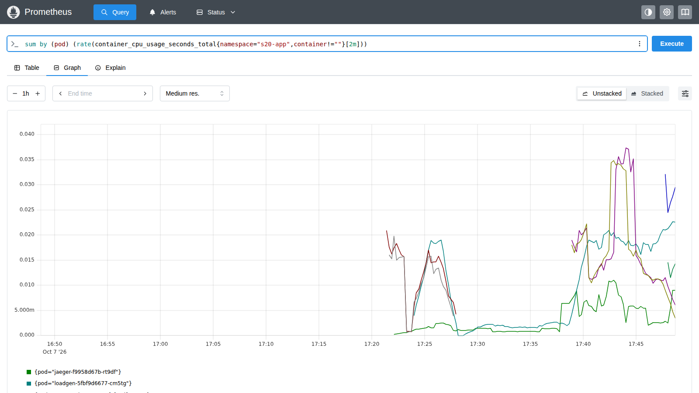

### 1.5 Application metrics: `up`, request counters, latency, error ratio

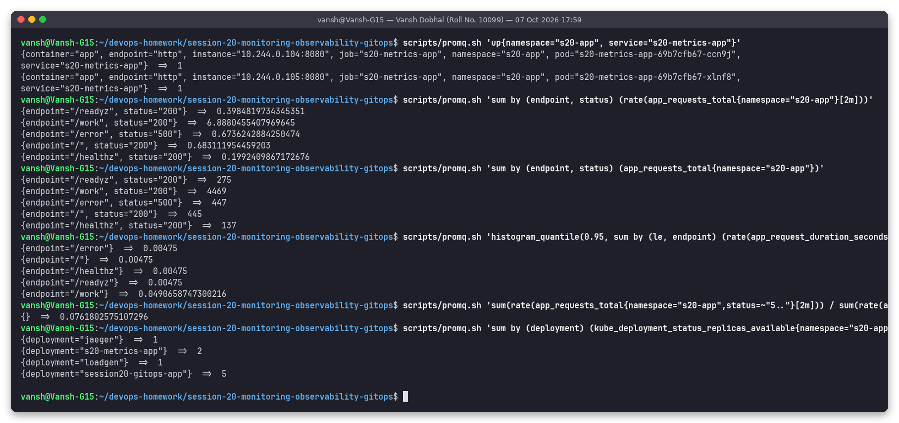

What I observed:

* `up` = 1 for both pods.
* About 6.9 req/s on `/work`, with p95 latency of about 49 ms. That fits the 10–50 ms sleep in the handler.
* The 5xx ratio is about 7.6%. The loadgen sends 1 of every 12 requests to `/error` (1/12 ≈ 8.3%), so this is just under the 10% threshold of `AppHighErrorRate`, and that alert correctly stayed inactive.

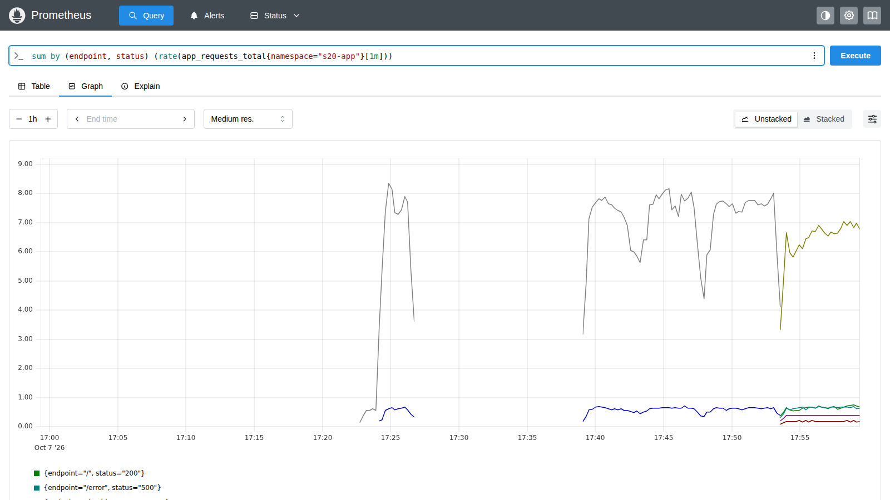

**Lesson learned: label collision.** At first, every series had `endpoint="http"`, and my own label showed up as `exported_endpoint`. The cause: the Prometheus Operator attaches a target label called `endpoint` (the Service port name), and on a clash Prometheus renames the scraped label. Setting `honorLabels: true` on the ServiceMonitor keeps the application's label. Before the fix:

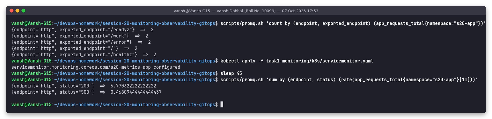

After the config reload:

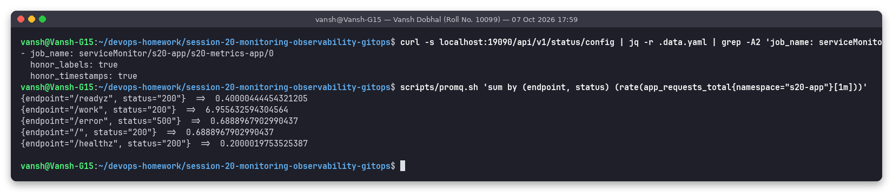

### 1.6 Logs

The app writes one JSON line per request to stdout. The kubelet stores this, and `kubectl logs` reads it. Because the lines are JSON, I can filter them with `grep` or `jq`. For example, counting status codes straight from the logs gives the same 200/500 split that the Prometheus counter shows.

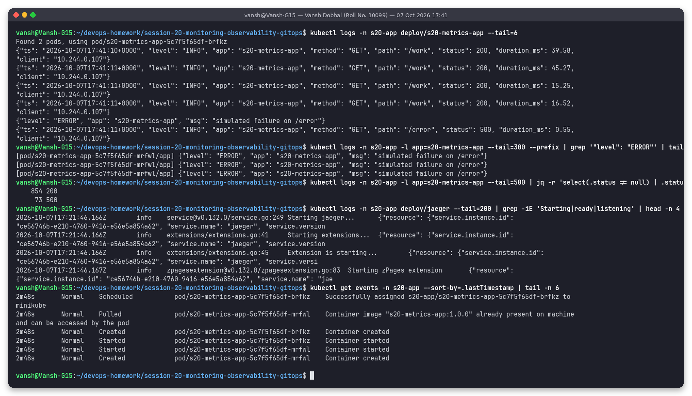

### 1.7 Application and cluster health

* **Liveness probe** `GET /healthz` every 10 s: if it fails 3 times, the kubelet restarts the container.
* **Readiness probe** `GET /readyz` every 5 s: if it fails, the pod is removed from the Service endpoints.
* **API server health:** `kubectl get --raw '/readyz?verbose'` lists every internal check (`readyz check passed`), and `/livez` returns `ok`.
* **Node conditions:** Ready=True, MemoryPressure=False, DiskPressure=False.

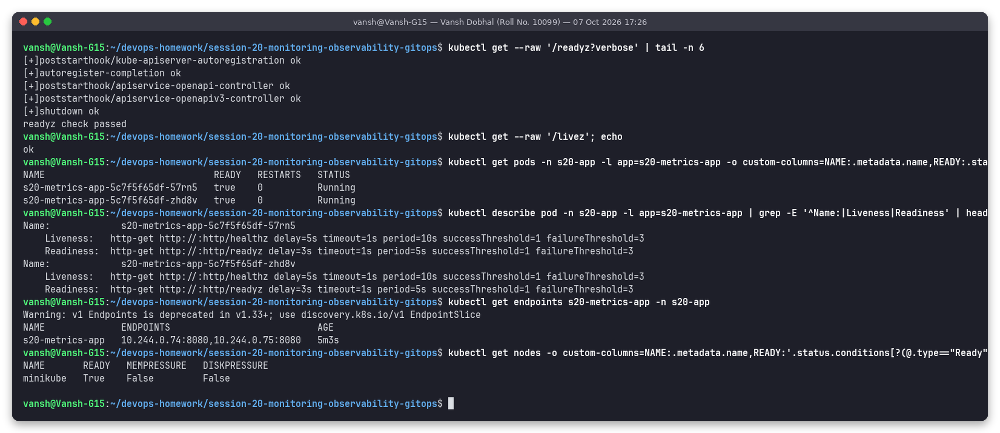

### 1.8 Alerts: PrometheusRule, firing and resolving

`task1-monitoring/k8s/prometheusrule.yaml` defines four alerts:

| Alert | Expression (short) | for | Severity |
|-------|--------------------|-----|----------|
| AppDown | `absent(up{namespace="s20-app",service="s20-metrics-app"} == 1)` | 30s | critical |
| AppHighErrorRate | 5xx rate / total rate > 0.10 | 1m | warning |
| HighPodRestarts | `increase(kube_pod_container_status_restarts_total[10m]) > 3` | 1m | warning |
| AppHighCPU | CPU rate / CPU limit > 0.8 | 2m | warning |

I used `absent(... == 1)` for AppDown, not `up == 0`. When a Deployment is scaled to 0, the targets disappear completely, so `up == 0` would never match. `absent()` still fires in that case.

The rules were loaded and all `inactive`:

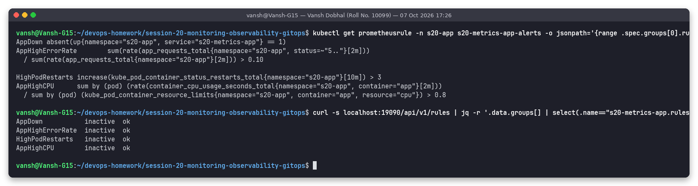

**Failure test:** I scaled the app to 0. After 30 s the alert was `pending`. After the `for: 30s` window it was `firing`, and Alertmanager listed it as `active`.

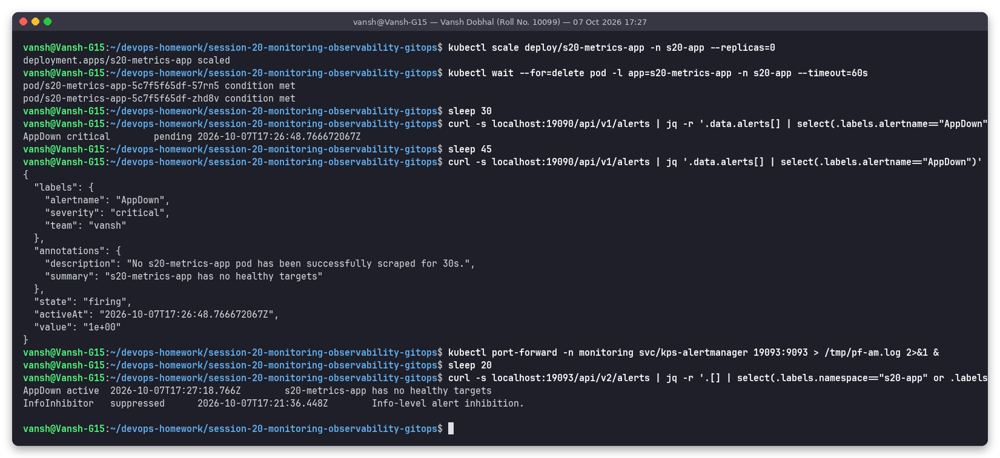

The firing alert in the real Prometheus and Alertmanager UIs:

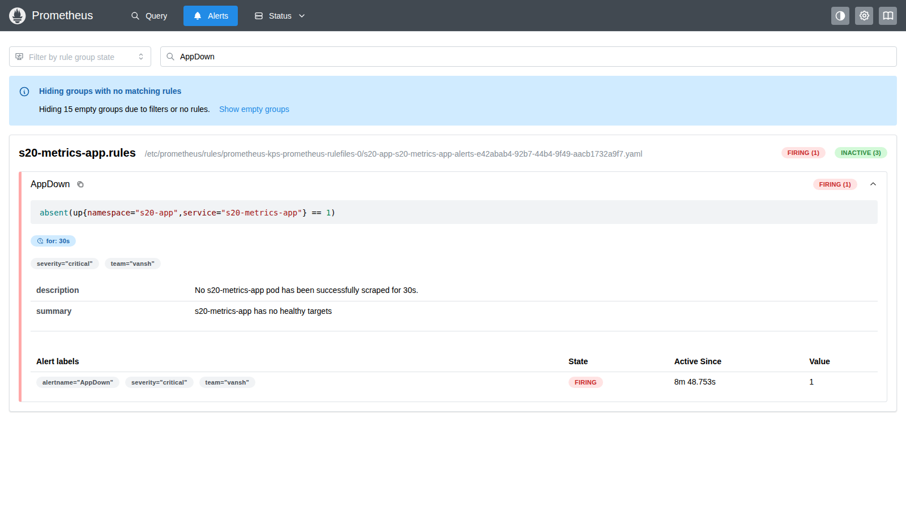
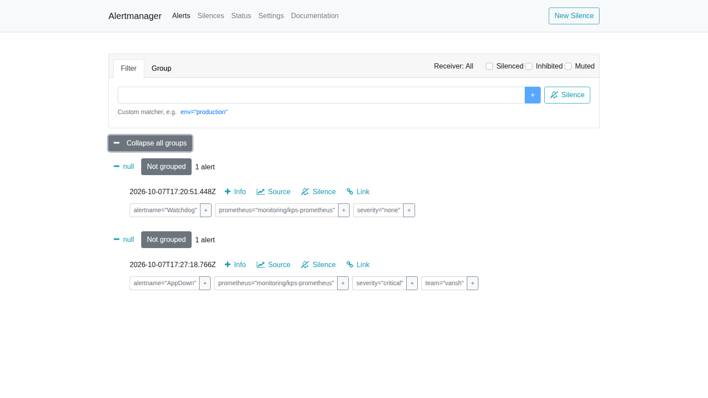

I then scaled back to 2 replicas. `up` returned to 1 and the alert resolved:

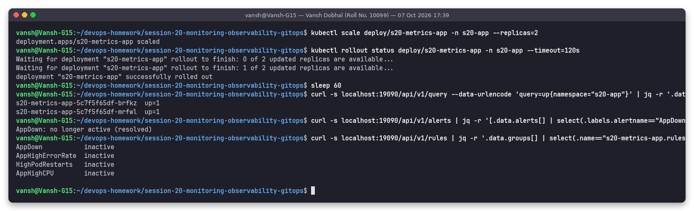

### 1.9 Grafana

I checked Grafana through its HTTP API:

* `/api/health` reports database ok and version 13.2.3.
* Two datasources were provisioned (Prometheus and Alertmanager).
* My dashboard was loaded from the ConfigMap with 8 panels.
* A query through Grafana's Prometheus datasource proxy returned live data.

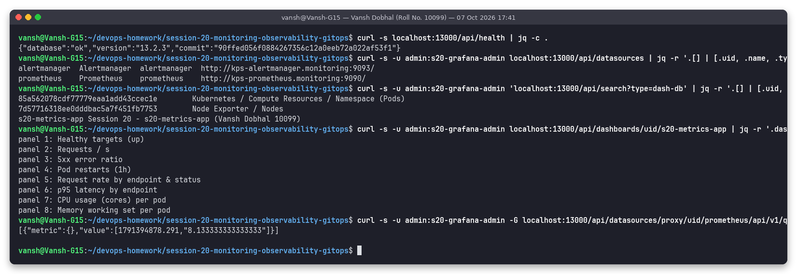

**My dashboard** (`grafana/dashboard-configmap.yaml`). Panels: healthy targets, requests/s, 5xx ratio, pod restarts, request rate by endpoint and status, p95 latency, and CPU and memory per pod. The two gaps in the time series are real: the first is when the app was at 0 replicas for the AppDown test, and the second is the rollout to v1.1.0.

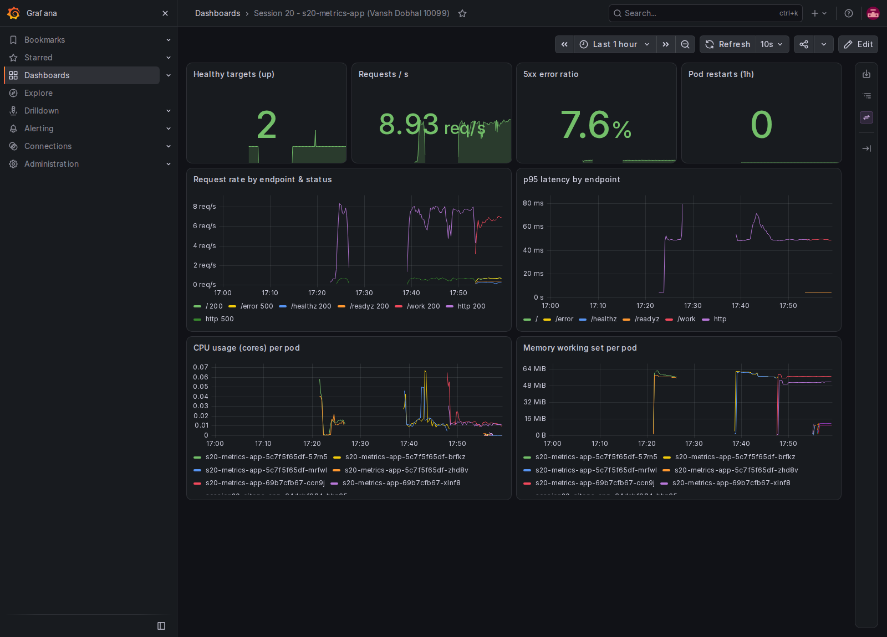

The built-in **Kubernetes / Compute Resources / Namespace (Pods)** dashboard for `s20-app` shows CPU and memory against requests and limits:

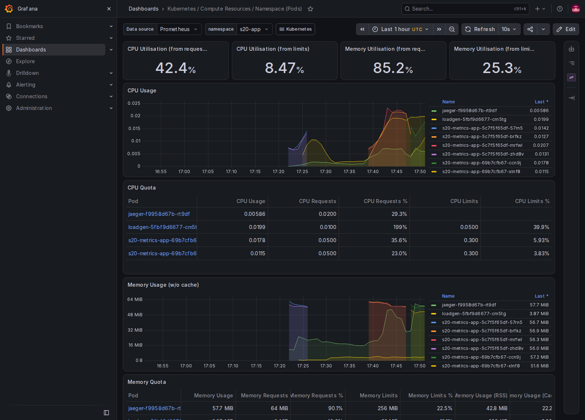

> Grafana was OOM-killed once (exit code 137) under the 320Mi limit while the cluster was busy. I raised its limit to 512Mi with `helm upgrade` (see `scripts/06-grafana-browser.sh`). This is a small real example of monitoring the monitoring stack itself.

---

## Task 2: Observability

### 2.1 What is observability, and why is it required?

**Observability** is how well you can understand a system's internal state from the data it emits, including problems you did not predict in advance. **Monitoring** is the practice of watching known indicators and alerting when they cross a threshold. Monitoring tells you *that* something is wrong. Observability lets you ask *why*, without shipping new code to find out.

Modern systems need it for these reasons:

* A single user request can cross many services, pods and nodes. No single dashboard can show where it slowed down.
* Pods are short-lived. A pod that crashed 5 minutes ago no longer exists to SSH into, so its signals must already be collected centrally.
* Autoscaling, rolling updates and GitOps change the system many times a day. You need data to connect a regression to a specific change.
* SLOs and error budgets need measurable signals such as latency percentiles and error ratios.

### 2.2 Monitoring vs observability

| | Monitoring | Observability |
|--|-----------|---------------|
| Question it answers | "Is it broken? Is X above a threshold?" | "Why is it broken? What is different about the failing requests?" |
| Failure type | Known failures (disk full, pod down) | Unknown failures (only some users on one version see slow checkouts) |
| Data | Pre-defined metrics and checks | Metrics + logs + traces with high-cardinality context (request IDs, user, version) |
| Output | Dashboards and alerts | Exploration, correlation, drill-down from a metric to a trace to the log line |
| Example in this lab | `AppDown` fired when the targets vanished | The Jaeger trace showed that ~48 ms of a 50 ms `/work` request was spent in `downstream-call`, not in `compute` |

Monitoring is a subset of observability. You still need alerts, but they are the starting point of an investigation.

### 2.3 The three pillars: metrics, logs and traces

| Signal | What it is | Strengths | Weaknesses | In this lab |
|--------|-----------|-----------|------------|-------------|
| **Metrics** | Numeric time series with labels, sampled at intervals (counter, gauge, histogram, summary) | Cheap to store, fast to aggregate, ideal for alerts and trends | Lose individual event detail; high-cardinality labels are expensive | `app_requests_total`, `app_request_duration_seconds`, `container_cpu_usage_seconds_total` in Prometheus |
| **Logs** | Timestamped records of discrete events (ideally structured JSON) | Full detail and context of a single event; good for errors and audits | Large volume, costly to index, hard to aggregate unless structured | One JSON line per request: `kubectl logs`, then `jq` to count status codes |
| **Traces** | The path of one request through services, made of **spans** (operation, start, duration, parent) that share a trace ID | Show where time goes and which hop failed in a distributed call | Need instrumentation and context propagation; usually sampled | OpenTelemetry spans `GET /work` → `compute`, `downstream-call` in Jaeger |

Events (`kubectl get events`) and profiles (continuous profiling) are often called the 4th and 5th signals.

### 2.4 Real trace demo (OpenTelemetry → Jaeger)

* `app.py` sets up the OpenTelemetry SDK when `OTEL_EXPORTER_OTLP_ENDPOINT` is set.
* `FlaskInstrumentor` creates a server span for every request. I added manual child spans `compute` and `downstream-call` inside `/work`.
* Spans go over OTLP/HTTP to Jaeger v2 (`task2-observability/otel-jaeger/jaeger.yaml`), which uses in-memory storage and 64Mi requests.

**Bug I hit:** in version 1.0.0 only the manual spans were exported, and each one became its own root trace. The cause was `excluded_urls="metrics,healthz,readyz"`. These are regexes matched against the *full URL*, and `http://s20-metrics-app/work` contains the string "metrics" because of the service name. So every real request was excluded from instrumentation. Version 1.1.0 anchors the patterns as `/metrics,/healthz,/readyz`:

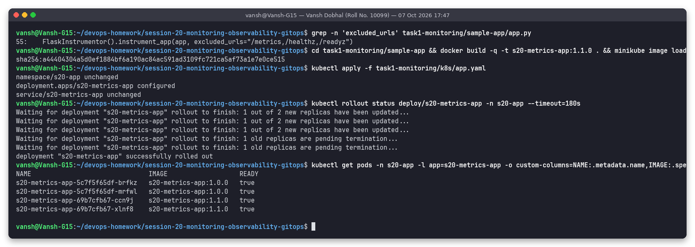

After the fix, one `GET /work` trace holds 3 spans with the right parent/child links. A `GET /error` span carries `http.status_code=500` and `otel.status_code=ERROR`:

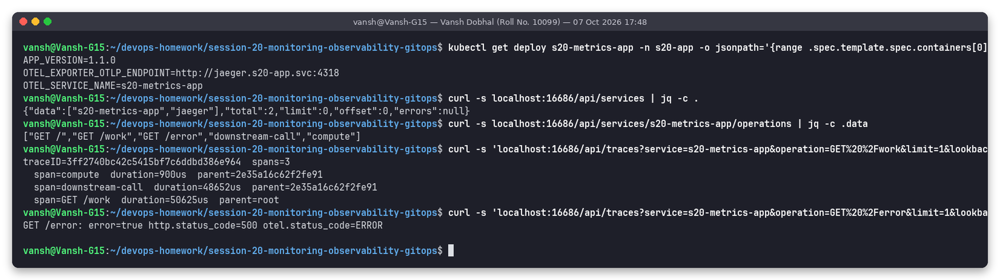

The same data in the real Jaeger UI:

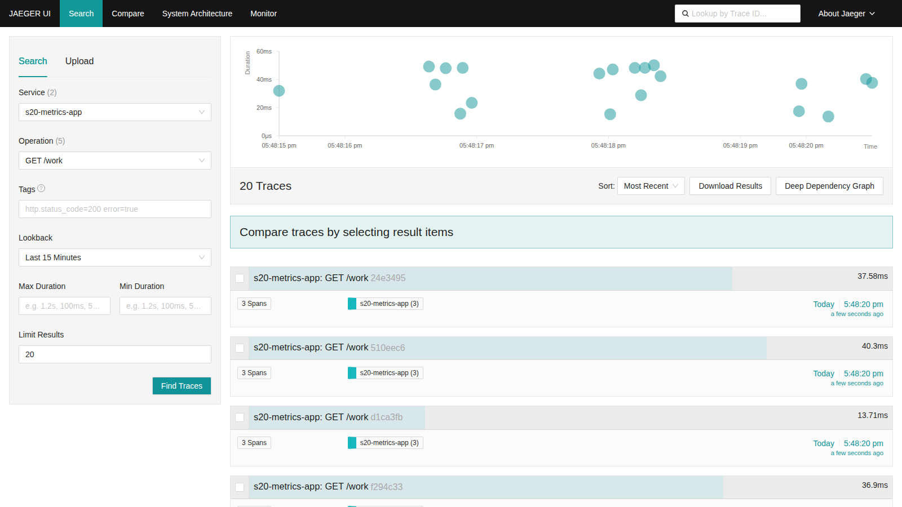
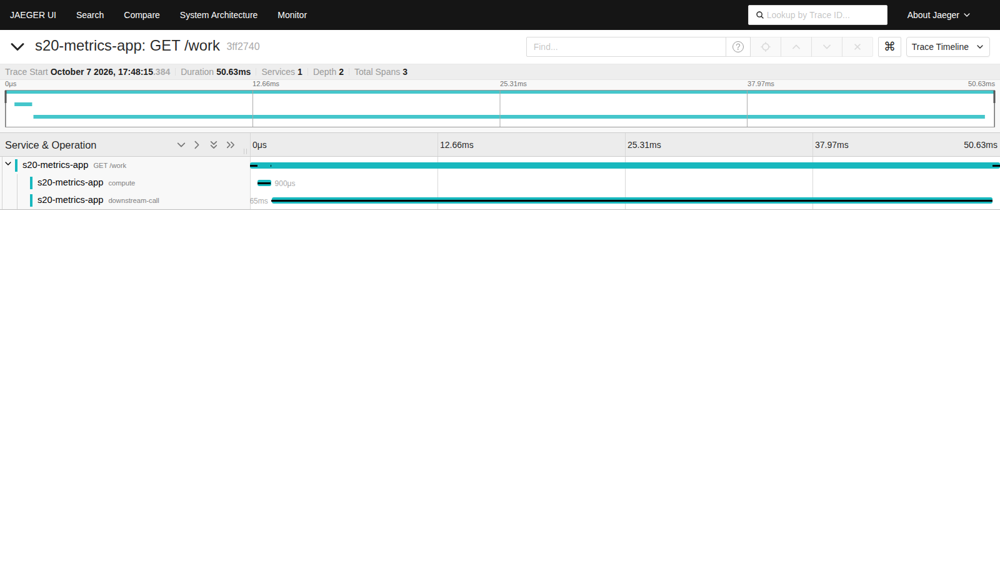

### 2.5 Common observability tools

| Tool | Signal(s) | Type | What it does | Notes |
|------|-----------|------|--------------|-------|
| **Prometheus** | Metrics | OSS (CNCF graduated) | Pull-based scraping, TSDB, PromQL, alert rules | Used here via the Prometheus Operator |
| **Alertmanager** | Alerts | OSS | Dedupes, groups, silences and routes alerts (Slack, PagerDuty, e-mail) | Part of kube-prometheus-stack |
| **Grafana** | Visualisation (all signals) | OSS / Grafana Cloud | Dashboards and alerting over many datasources | Dashboards here are provisioned from a ConfigMap |
| **Loki** | Logs | OSS (Grafana Labs) | Indexes only labels, stores compressed chunks, LogQL; cheap | Not installed here to save memory on the shared cluster; `kubectl logs` + JSON was enough |
| **ELK / EFK** | Logs (+ APM) | OSS / Elastic | Elasticsearch + Logstash or **Fluentd/Fluent Bit** + Kibana; full-text indexing | Powerful search, but heavy on RAM and disk |
| **Jaeger** | Traces | OSS (CNCF graduated) | Trace storage, search and UI; v2 is built on the OTel Collector | Used here |
| **Tempo** | Traces | OSS (Grafana Labs) | Trace store on object storage, no index, queried by trace ID or TraceQL | Pairs with Loki and Grafana |
| **OpenTelemetry** | Metrics, logs, traces | OSS standard (CNCF) | Vendor-neutral APIs, SDKs, OTLP protocol and Collector | Used here (SDK + OTLP); avoids vendor lock-in |
| **Datadog** | All + APM, RUM, security | SaaS | Agent-based, very broad integrations, correlates all signals | Paid per host or per volume |
| **New Relic** | All + APM | SaaS | APM roots, NRQL query language, usage-based pricing | Paid |

### 2.6 Kubernetes observability building blocks

| Component | What it exposes | How I used it |
|-----------|-----------------|---------------|
| **metrics-server** | Current CPU and memory per pod and node (Metrics API); used by `kubectl top` and the HPA | `kubectl top pods -n s20-app` |
| **kube-state-metrics** | Object *state* from the API: replicas, restarts, resource requests and limits, pod phase | `kube_deployment_status_replicas_available`, `kube_pod_container_status_restarts_total`, the AppHighCPU rule |
| **node-exporter** | Host metrics: CPU modes, memory, disk, network, filesystem | Node CPU % and memory % queries |
| **cAdvisor** (built into the kubelet) | Per-container CPU, memory, network and filesystem usage | `container_cpu_usage_seconds_total`, `container_memory_working_set_bytes` |
| **Events** | Short-lived records of what controllers did (Scheduled, Pulled, Killing, BackOff...) | `kubectl get events --sort-by=.lastTimestamp`; Argo CD sync events in Task 3 |
| **Logs** | Container stdout/stderr, stored by the kubelet and read by `kubectl logs` or shipped by Fluent Bit / Promtail | JSON request logs |
| **Probes and API health** | Liveness, readiness and startup probes; API server `/livez` and `/readyz` | Section 1.7 |

---

## Task 3: GitOps

### 3.1 What is GitOps?

GitOps is a way of operating infrastructure and applications in which:

1. **Git is the single source of truth.** The desired state of the system (manifests, Helm values) lives in a Git repository. Every change is a commit or pull request, so history, review, blame and rollback (`git revert`) come for free.
2. **The configuration is declarative.** You describe *what* should exist (a Deployment with 5 replicas of `nginx:1.27-alpine`), not the imperative steps to get there.
3. **An agent pulls the state.** An agent inside the cluster (Argo CD or Flux) pulls from Git. CI never needs cluster-admin credentials, so this is a *pull* model, not a *push* model.
4. **Reconciliation is continuous.** The agent compares the live state with the desired state in a loop. Any difference, called **drift**, is reported (OutOfSync) and can be corrected automatically (**self-heal**).

### 3.2 GitOps workflow

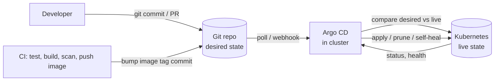
```mermaid
flowchart LR
  dev[Developer] -->|git commit / PR| repo[(Git repo<br/>desired state)]
  ci[CI: test, build, scan, push image] -->|bump image tag commit| repo
  repo -->|poll / webhook| argo[Argo CD<br/>in cluster]
  argo -->|compare desired vs live| k8s[(Kubernetes<br/>live state)]
  argo -->|apply / prune / self-heal| k8s
  k8s -->|status, health| argo
```

### 3.3 Kubernetes + GitOps

Kubernetes is a natural fit for GitOps because it is already declarative and controller-based. Every object has a `spec` (desired) and a `status` (observed), and controllers reconcile them. Argo CD applies the same idea one level higher: it treats a folder in Git as the `spec` of a whole application. Argo CD concepts I used:

| Concept | Meaning |
|---------|---------|
| Application | CRD that maps *repo + revision + path* to *cluster + namespace* |
| Sync status | `Synced` / `OutOfSync`: does the live state equal the Git state? |
| Health status | `Healthy` / `Progressing` / `Degraded`: are the resources working? |
| `automated.prune` | Delete live objects that were removed from Git |
| `automated.selfHeal` | Revert manual changes in the cluster back to the Git state |

### 3.4 Install Argo CD

I used the official non-HA `install.yaml`, applied with `--server-side` exactly as in the instructor's README. To save resources on the shared cluster, I scaled `dex-server` (SSO) and `notifications-controller` to 0. Neither is needed for local admin login.

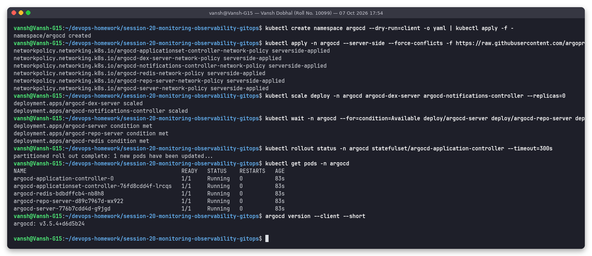

### 3.5 Application synced from Git (Synced / Healthy)

The submission repo has not been pushed to GitHub yet, so the live demo uses the instructor's public repo `Nency-Ravaliya/devops-heros`, path `session20-monitoring-observability-gitops/07-argocd/app`. That folder also contains the `argocd-application.yaml` file. I excluded it with `directory.exclude` so that Argo CD does not try to manage an Application as a workload. This followed the instructor's own warning: "do not put it under the Git source path".

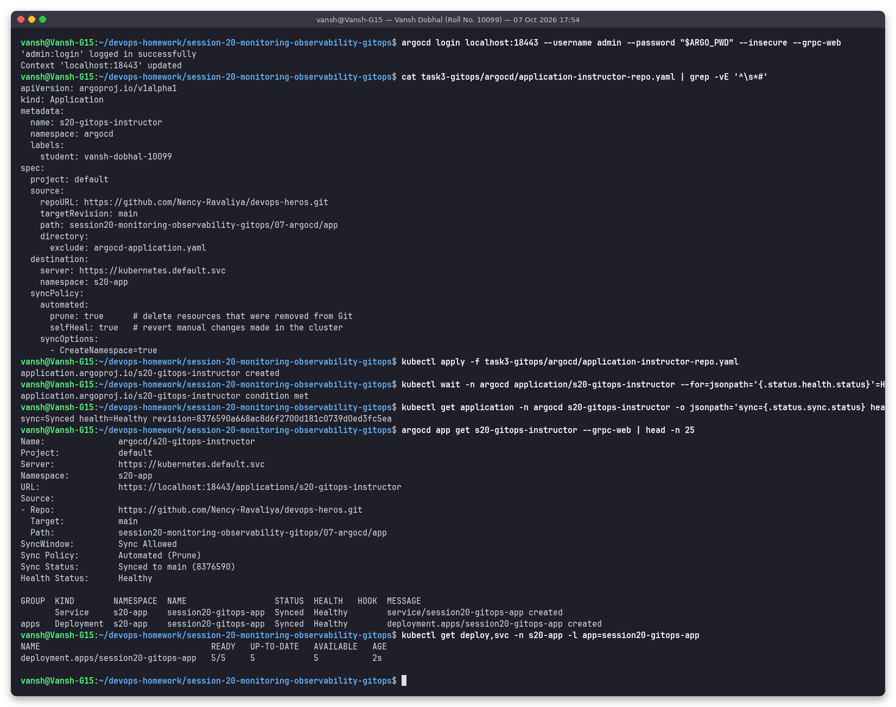

Argo CD reports `Synced to main (8376590)` and `Healthy`. The cluster runs **5** replicas because the latest commit in Git, `8376590 replicas from 2 to 5`, says so. That commit is the source of truth:

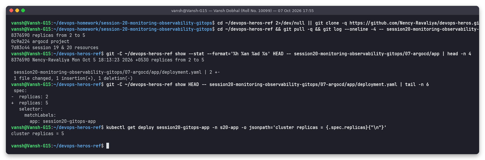

The Argo CD UI (real capture). It shows the commit author and message "replicas from 2 to 5" and the resource tree (Service, Deployment, 2 ReplicaSets, 5 pods):

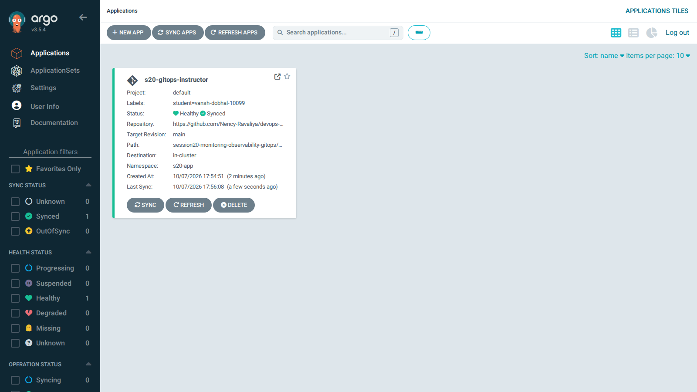
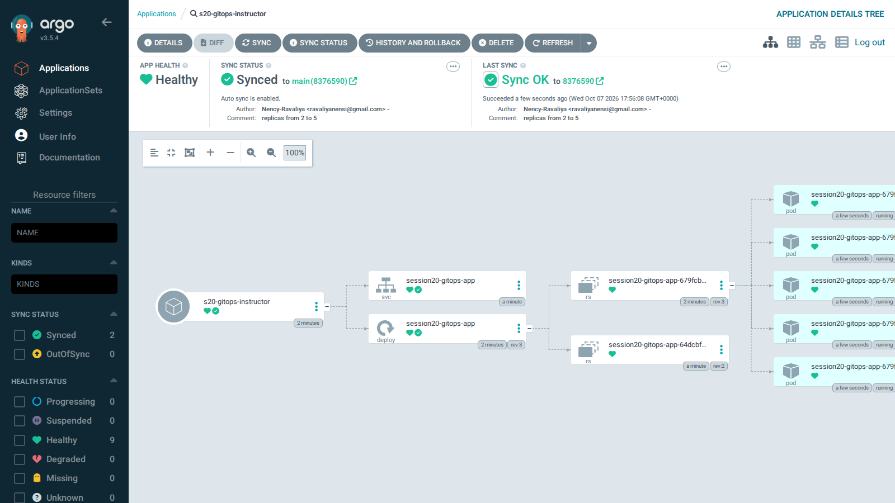

### 3.6 Self-heal

First I scaled the Deployment to 1 by hand. Within 15 s Argo CD had put it back to 5/5. Then I deleted the Service, and Argo CD recreated it (AGE 15s). The events show `Synced -> OutOfSync`, then `Initiated automated sync`, then `OutOfSync -> Synced`.

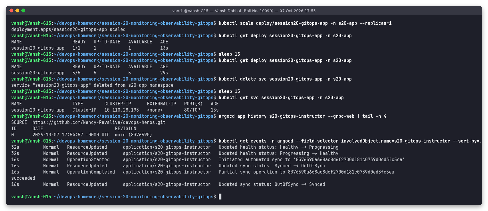

### 3.7 Drift detection

To make the drift visible, I temporarily turned `selfHeal` off. Then I changed the image to `nginx:1.26-alpine` and scaled to 2 replicas:

* `kubectl get application -o jsonpath` showed `sync=OutOfSync`.
* `argocd app diff` printed the exact difference between live and Git (`replicas: 2` vs `5`, `nginx:1.26-alpine` vs `nginx:1.27-alpine`).
* `argocd app sync` restored the Git state. I then turned self-heal back on, and the app was `Synced` / `Healthy` with 5 × `nginx:1.27-alpine`.

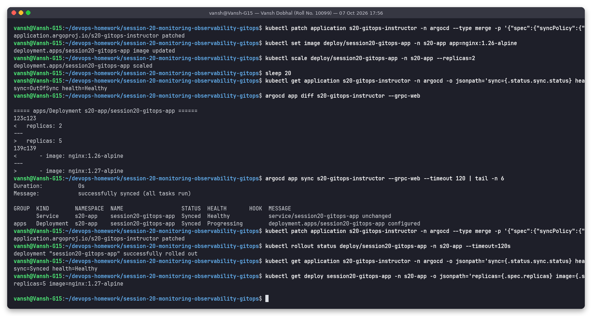

### 3.8 My own GitOps manifests (to use after pushing)

`task3-gitops/gitops/s20-metrics-app/` holds the declarative desired state of my Task 1 app: Deployment, Service, ServiceMonitor and PrometheusRule. `task3-gitops/argocd/application-devops-homework.yaml` points Argo CD at `https://github.com/v4xsh/devops-homework.git`, path `session-20-monitoring-observability-gitops/task3-gitops/gitops/s20-metrics-app`, with automated prune and self-heal.

**What is and is not proven:**

* The repo is not on GitHub yet, so Argo CD cannot fetch it. Syncing *this* Application has **not** been run.
* What I did run: a server-side dry-run of the manifests and of the Application object. Both were accepted by the API server.

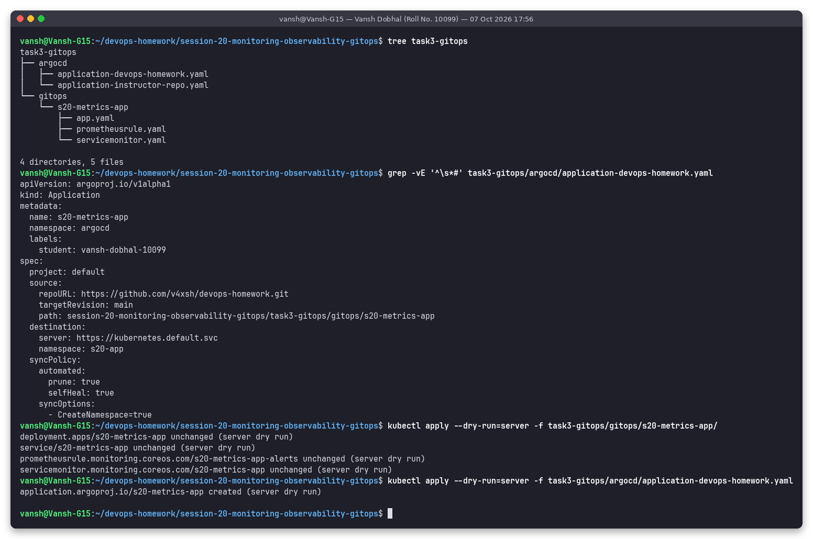

After `git push`:

```bash
kubectl apply -f session-20-monitoring-observability-gitops/task3-gitops/argocd/application-devops-homework.yaml
argocd app get s20-metrics-app          # expect Synced / Healthy
# change replicas in task3-gitops/gitops/s20-metrics-app/app.yaml, commit, push -> Argo CD rolls it out (default poll: 3 min)
```

The image `s20-metrics-app:1.1.0` exists only inside minikube (loaded with `minikube image load`). On another cluster, it would first need to be pushed to a registry such as GHCR. Session 21 does exactly that in its CI pipeline, and also runs a complete commit-to-sync GitOps loop with my own Helm chart.

---

## How to reproduce

```bash
cd ~/devops-homework/session-20-monitoring-observability-gitops
bash scripts/01-install-monitoring.sh        # build image, helm install kps, deploy app/jaeger/ServiceMonitor/rules/dashboard
bash scripts/port-forwards.sh &              # 19090 / 19093 / 13000 / 16686 / 18443
bash scripts/02-monitoring-demo.sh           # loadgen, metrics, targets, PromQL, logs, health, AppDown firing
bash scripts/04-restore-and-dashboards.sh    # resolve alert, Grafana API, browser captures
bash scripts/05-tracing-fix-and-browser.sh   # v1.1.0 tracing fix, Jaeger
bash scripts/07-argocd-demo.sh               # Argo CD install, sync, self-heal, drift
# Grafana login: admin / s20-grafana-admin (lab only)
# Argo CD login: admin / $(kubectl -n argocd get secret argocd-initial-admin-secret -o jsonpath='{.data.password}' | base64 -d)
```

Clean-up: `helm uninstall kps -n monitoring; kubectl delete ns s20-app; kubectl delete -n argocd -f https://raw.githubusercontent.com/argoproj/argo-cd/stable/manifests/install.yaml`.

## What I learned

* `absent()` is the right tool for "service is down" when the targets can disappear entirely.
* The Prometheus Operator target labels (`endpoint`, `pod`, `service`, `namespace`) can collide with application labels. Use `honorLabels`, or avoid those label names.
* OpenTelemetry `excluded_urls` patterns are regexes over the *full* URL, so anchor them.
* A monitoring stack needs its own limits and alerts too: Grafana was OOM-killed at 320Mi.
* With GitOps, `kubectl scale` stops being a way to change the system. Argo CD reverts it within seconds. The only lasting way to change the system is a commit.
