# Session 21: Final DevOps Project - TaskBoard, end to end

**Name:** Vansh Dobhal | **Roll No:** 10099

TaskBoard is a small project-management web app: a FastAPI REST API, a React UI and PostgreSQL. I took it from code all the way to a monitored, GitOps-managed Kubernetes deployment, and covered every stage of the course:

**application → tests → Docker → CI/CD + DevSecOps → Kubernetes → Helm → Terraform (AWS) → Prometheus/Grafana → Argo CD → troubleshooting**

The base application is the instructor's `session21-python` TaskBoard. I extended it with:

* a `/ready` endpoint that checks the database
* JSON logs and business metrics
* config through ConfigMap and Secret
* 12 tests
* hardened multi-stage images

Everything else (Helm chart, Terraform, pipeline, security tooling, monitoring, GitOps, troubleshooting) is my own work.

> **How the evidence was produced.**
> * **Terminal screenshots:** every PNG in `screenshots/` and `troubleshooting/screenshots/` comes from the `snap` tool, which runs the commands for real. The exact text of each run is in the matching `outputs/*.txt`.
> * **Browser screenshots:** the images in `screenshots/browser/` are real headless-Chromium captures of the running UIs (TaskBoard, Prometheus, Grafana, Argo CD).
> * **What could not run here:** a real AWS account and a GitHub-hosted runner. For those I used LocalStack and `act`, and each case is labelled where it appears.

---

## Table of contents

1. [Project overview](#1-project-overview)
2. [Architecture](#2-architecture)
3. [Technologies used](#3-technologies-used)
4. [Folder structure](#4-folder-structure)
5. [Application setup](#5-application-setup)
6. [Docker setup](#6-docker-setup)
7. [Kubernetes deployment](#7-kubernetes-deployment)
8. [Helm deployment](#8-helm-deployment)
9. [Terraform infrastructure](#9-terraform-infrastructure)
10. [CI/CD pipeline](#10-cicd-pipeline)
11. [DevSecOps implementation](#11-devsecops-implementation)
12. [Monitoring](#12-monitoring)
13. [GitOps](#13-gitops)
14. [Final Troubleshooting Challenge](#14-final-troubleshooting-challenge)
15. [Screenshots index](#15-screenshots-index)
16. [How to reproduce](#16-how-to-reproduce)
17. [What was real and what was simulated](#17-what-was-real-and-what-was-simulated)
18. [Lessons learned](#18-lessons-learned)

---

## 1. Project overview

| Item | Value |
|------|-------|
| Application | TaskBoard: create, list, update and delete tasks, plus a stats dashboard |
| Backend | FastAPI 0.142 / Python 3.12, SQLAlchemy 2, Alembic migrations, Prometheus instrumentation |
| Frontend | React 19 + Vite 7, served by unprivileged Nginx (port 8080) |
| Database | PostgreSQL 16 (StatefulSet with a 1 Gi PVC) |
| Images | `ghcr.io/v4xsh/taskboard-backend:1.0.1`, `ghcr.io/v4xsh/taskboard-frontend:1.0.1` |
| Local cluster | minikube (Kubernetes v1.37, ingress-nginx + metrics-server addons) |
| Namespaces used | `final-app` (Helm release), `final-k8s` (plain manifests demo), `final-gitops` (Argo CD app), `final-gitea` (local Git server), `final-ts` (troubleshooting), `monitoring` + `argocd` (shared with session 20) |

**API endpoints:**

| Method | Path | Purpose |
|--------|------|---------|
| GET | `/health` | liveness: the process is alive (no dependencies checked) |
| GET | `/ready` | readiness: runs `SELECT 1` against PostgreSQL; returns **503** if the DB is unreachable |
| GET | `/metrics` | Prometheus metrics: `http_requests_total`, `http_request_duration_seconds`, `taskboard_tasks_created_total`, `taskboard_app_info` |
| GET | `/api/info` | version and environment |
| GET / POST | `/api/tasks` | list (newest first) / create |
| GET / PUT / DELETE | `/api/tasks/{id}` | read / partial update / delete |
| GET | `/api/tasks/stats` | counts by status |

## 2. Architecture

Rendered diagram (`docs/architecture.png`, rendered from `docs/architecture.mmd` with mermaid.js in headless Chromium by `docs/render_mermaid.py`):

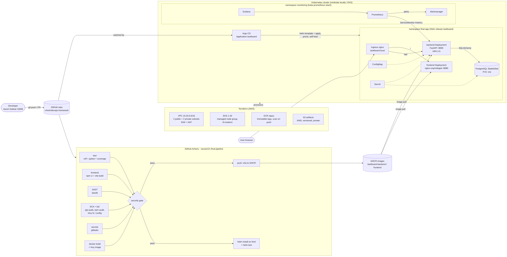

The same diagram as Mermaid source:

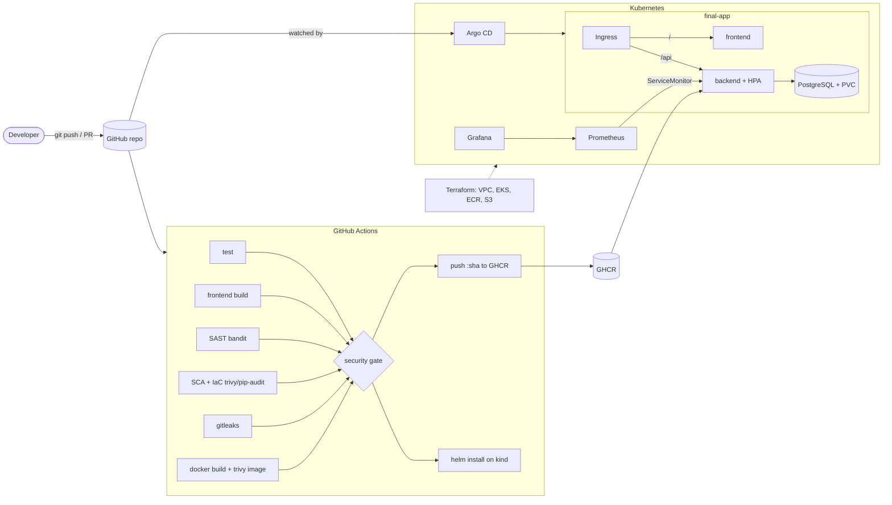
```mermaid
flowchart LR
  dev([Developer]) -->|git push / PR| gh[(GitHub repo)]
  gh --> CI
  subgraph CI["GitHub Actions"]
    t[test] --> g{security gate}
    f[frontend build] --> g
    sast[SAST bandit] --> g
    sca[SCA + IaC trivy/pip-audit] --> g
    gl[gitleaks] --> g
    b[docker build + trivy image] --> g
    g --> push[push :sha to GHCR]
    g --> kind[helm install on kind]
  end
  push --> ghcr[(GHCR)]
  subgraph K8S["Kubernetes"]
    argo[Argo CD] --> app
    subgraph app["final-app"]
      ing[Ingress] -->|/| fe[frontend]
      ing -->|/api| be[backend + HPA]
      be --> pg[(PostgreSQL + PVC)]
    end
    prom[Prometheus] -->|ServiceMonitor| be
    graf[Grafana] --> prom
  end
  gh -->|watched by| argo
  ghcr --> be
  TF[Terraform: VPC, EKS, ECR, S3] -.-> K8S
```

**Request flow:** browser → ingress-nginx (`taskboard.local`).
* `/` goes to the frontend Service, which serves the static React bundle.
* `/api/*` goes to the backend Service (ClusterIP :8000), then a FastAPI pod, then PostgreSQL through the headless Service `taskboard-postgres`.

Prometheus scrapes every backend pod's `/metrics` through the ServiceMonitor. Argo CD keeps the release equal to what is in Git.

## 3. Technologies used

| Area | Tools |
|------|-------|
| App | Python 3.12, FastAPI, SQLAlchemy, Alembic, Pydantic Settings, React 19, Vite 7 |
| Testing / quality | pytest, pytest-cov (98% coverage), ruff, httpx TestClient, SQLite test DB |
| Containers | Docker BuildKit multi-stage builds, docker compose, nginx-unprivileged |
| CI/CD | GitHub Actions, `act` 0.2.89 (local run), GHCR, kind, helm/kind-action |
| DevSecOps | bandit (SAST), pip-audit + npm audit + Trivy fs (SCA), Trivy config (IaC), gitleaks (secrets), Trivy image (container CVEs), custom security gate |
| Kubernetes | Deployment, StatefulSet, Service, Ingress, ConfigMap, Secret, PVC, HPA (autoscaling/v2), startup/liveness/readiness probes, securityContext |
| Packaging | Helm 3 chart `taskboard` with dev/prod/gitops values and `helm test` |
| IaC | Terraform 1.16, AWS provider 5.100, LocalStack 4.9 for a real local apply |
| Observability | kube-prometheus-stack (Prometheus, Alertmanager, Grafana), ServiceMonitor, PrometheusRule, Grafana dashboard as code |
| GitOps | Argo CD v3.5.4, Gitea (in-cluster Git server for the live demo) |

## 4. Folder structure

```
final-devops-project/
├── application/
│   ├── backend/            # FastAPI app (app/), Alembic migrations, tests/ (12 tests), requirements*.txt, ruff.toml
│   └── frontend/           # React + Vite UI, package-lock.json
├── docker/
│   ├── backend.Dockerfile  (+ .dockerignore)   # multi-stage, venv copied into slim runtime, UID 10001
│   ├── frontend.Dockerfile (+ .dockerignore)   # node build stage -> nginx-unprivileged runtime, UID 101
│   ├── nginx/default.conf.template             # SPA + /api proxy, security headers, /healthz
│   └── docker-compose.yml                      # postgres + migrate + backend + frontend
├── kubernetes/             # plain manifests: namespace, ConfigMap+Secret, Postgres StatefulSet+PVC, backend, frontend, Ingress+HPA
├── helm/taskboard/         # Helm chart (templates, values.yaml, values-dev/prod/gitops.yaml, dashboards/, tests/)
├── terraform/              # VPC, EKS, ECR, S3, KMS; localstack.tfvars, terraform.tfvars.example, .terraform.lock.hcl
├── .github/workflows/final-pipeline.yml       # pipeline (identical copy at repo root, see section 10)
├── security/               # bandit.yaml, gitleaks.toml, trivy.yaml, .trivyignore, security-gate.sh, reports/
├── monitoring/             # rendered ServiceMonitor + PrometheusRule, Grafana dashboard JSON, kube-prometheus-stack values
├── gitops/                 # Argo CD Applications (local Gitea demo + GitHub), local-git-server/gitea.yaml
├── troubleshooting/        # base/ manifests, scenarios/<n>/broken-*.yaml, screenshots/, outputs/
├── docs/                   # architecture.mmd / architecture.png / render_mermaid.py
├── scripts/                # 01..10 - every command used, in order (each one calls `snap`)
├── screenshots/  outputs/  # evidence (PNG + exact text)
└── README.md
```

## 5. Application setup

### Code changes compared to the instructor's base app

* `config.py`: 12-factor settings. `DB_HOST`, `DB_NAME` and `DB_USER` come from a ConfigMap and `DB_PASSWORD` from a Secret. `DATABASE_URL` overrides all of them (used by tests and compose).
* `main.py`:
  * A `lifespan` hook replaces the deprecated `on_event`.
  * `/ready` really checks the database and returns 503 when it fails.
  * One JSON log line per request.
  * Business metrics: `taskboard_tasks_created_total{priority}`, `taskboard_tasks_deleted_total` and `taskboard_app_info{version,env}`.
  * The probe and metrics endpoints are excluded from the HTTP metrics.
* Tests use a throw-away SQLite file (`tests/conftest.py`), never the real database. There are 12 tests:
  * health, ready, ready-returns-503 (with an injected broken DB session), info, metrics format
  * create/get, list order, partial update, delete, stats, 404s, validation (422)

### Run locally

```bash
cd application/backend
python3 -m venv .venv && . .venv/bin/activate && pip install -r requirements-dev.txt
ruff check . && pytest -v --cov=app
DATABASE_URL=sqlite:///./dev.db uvicorn app.main:app --reload    # http://localhost:8000/docs
```

**Result:** ruff reports no issues, **12 passed**, **98% coverage**.

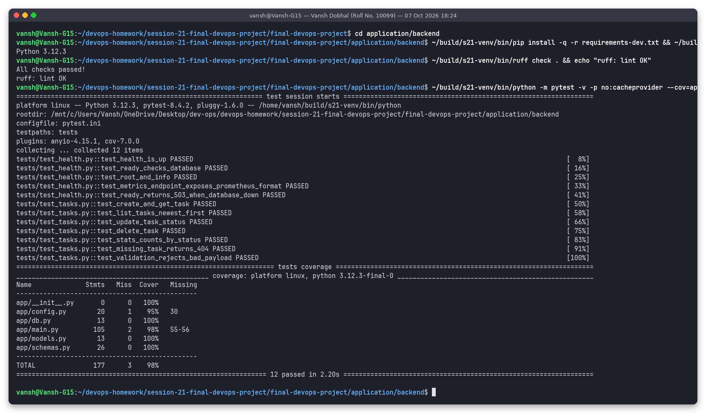

Frontend production build (Node 20, `npm ci` with the committed lock file):

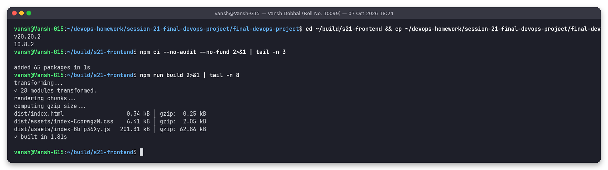

## 6. Docker setup

| | Backend | Frontend |
|--|---------|----------|
| Build stage | `python:3.12-slim`; builds a virtualenv in `/opt/venv`, then removes pip from it | `node:22-alpine`; `npm ci` (BuildKit cache mount) + `vite build` |
| Runtime stage | `python:3.12-slim` + `apt-get upgrade`; copies only the venv and the app code; pip/setuptools/wheel uninstalled | `nginxinc/nginx-unprivileged:1.29-alpine` + `apk upgrade`; copies only `dist/` and the config template |
| User | `10001:10001` (`app`) | `101` (`nginx`) |
| Port | 8000 | 8080 (non-root cannot bind to 80) |
| Healthcheck | Python `urllib` call to `/health` | `wget /healthz` |
| Size | 292 MB (1.0.1) | 112 MB |

Each Dockerfile has its own allow-list `.dockerignore` (`backend.Dockerfile.dockerignore`), so only the needed files reach the build context.

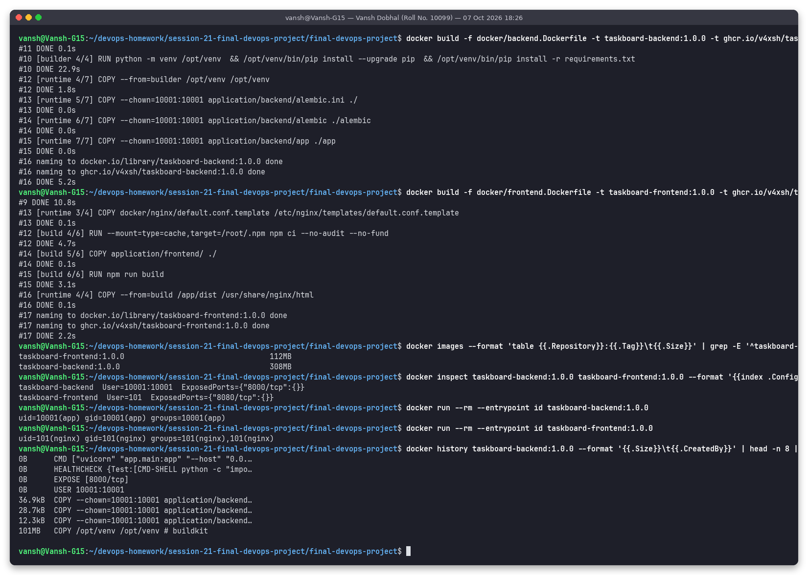

`docker compose` runs PostgreSQL (with a healthcheck), a one-shot `migrate` container (`alembic upgrade head`), the backend and the frontend:

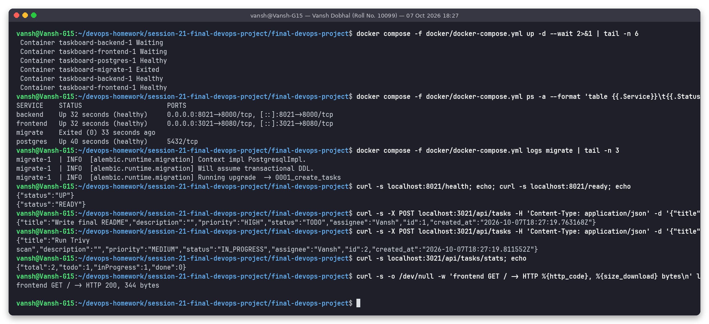

The real UI served by the compose stack, after creating two tasks through the API:

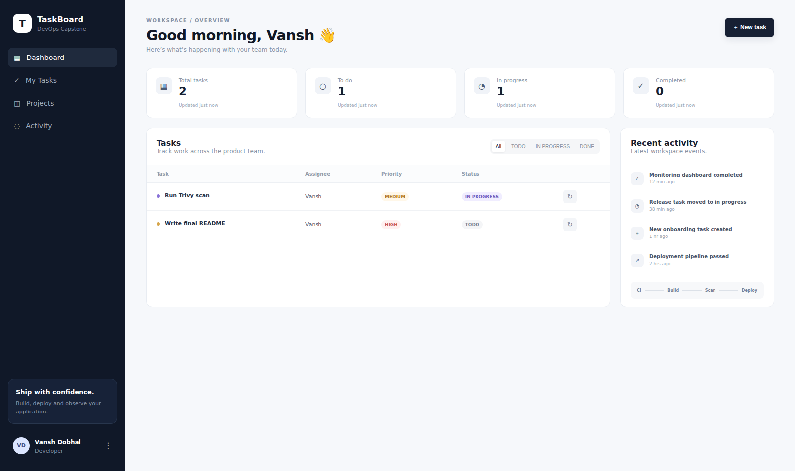

## 7. Kubernetes deployment

Plain manifests are in `kubernetes/`, in namespace `final-k8s`:

| File | Objects | Key points |
|------|---------|------------|
| `00-namespace.yaml` | Namespace | labels for ownership |
| `01-config.yaml` | ConfigMap `taskboard-config`, Secret `taskboard-db` | non-secret settings vs. password |
| `02-postgres.yaml` | headless Service, StatefulSet + **PVC** (volumeClaimTemplate 1 Gi) | the database is the only component that needs persistent storage; runs as UID 70 with a read-only root FS and emptyDir for `/var/run/postgresql` + `/tmp` |
| `03-backend.yaml` | Deployment (2 replicas) + Service | init container `migrate` runs Alembic; **startupProbe** `/health` (up to 60 s), **livenessProbe** `/health`, **readinessProbe** `/ready`; requests 100m/128Mi, limits 500m/256Mi; non-root, `readOnlyRootFilesystem`, all capabilities dropped, seccomp RuntimeDefault; `maxUnavailable: 0` |
| `04-frontend.yaml` | Deployment (2) + Service | probes on `/healthz`, emptyDirs for nginx temp/conf |
| `05-ingress-hpa.yaml` | Ingress + HPA | `/api` → backend, `/` → frontend; HPA 2-5 replicas on CPU 60% and memory 80% |

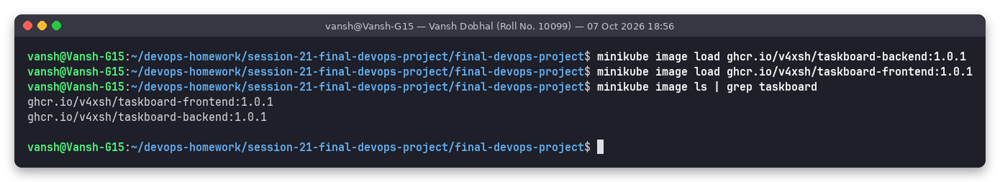
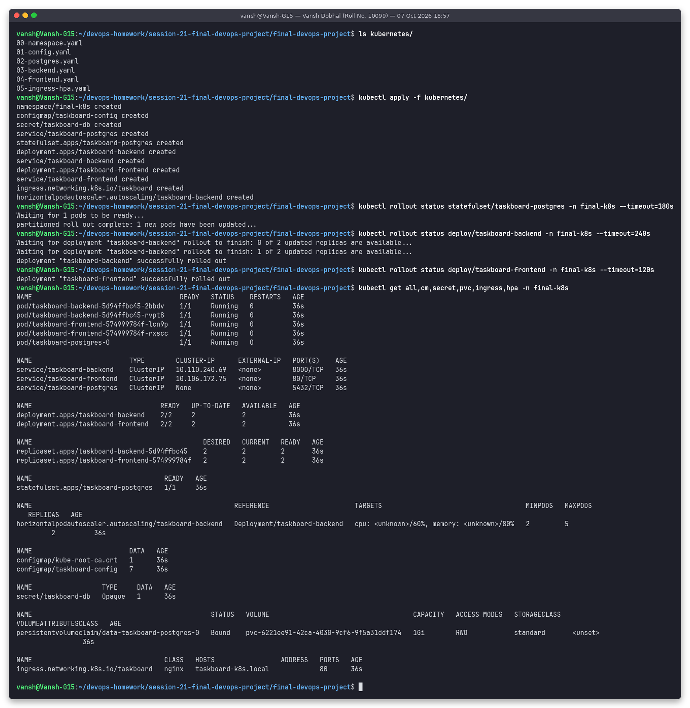

Verification:
* The `migrate` init-container logs show `Running upgrade -> 0001_create_tasks`.
* Every pod runs as non-root: UID 10001 (backend), 101 (frontend) and 70 (Postgres).
* Both endpoints are ready.
* The API answers through the Ingress, and the PVC is `Bound` on the `standard` StorageClass.

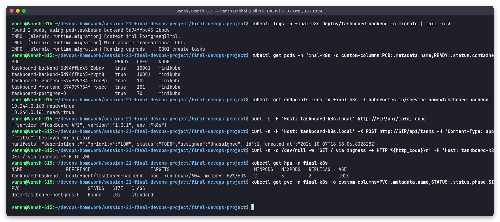

> The HPA showed `cpu: <unknown>` for its first ~2 minutes. metrics-server only scrapes every 60 s, so the HPA has no samples yet right after pods start. It turns into real numbers once data arrives (see the Helm HPA test below). After this check I deleted the `final-k8s` copy, because the Helm release is the real deployment.

## 8. Helm deployment

The chart is `helm/taskboard` (chart version 1.0.1, appVersion 1.0.1). Templates:

* `configmap.yaml`
* `secret.yaml`: generates a random DB password on first install, then keeps it on upgrades via `lookup`, with `helm.sh/resource-policy: keep`. It also supports `existingSecret`.
* `postgres.yaml`
* `backend.yaml`: init-container migrations, all three probes, and a `checksum/config` annotation so a ConfigMap change rolls the pods.
* `frontend.yaml`
* `ingress-hpa.yaml`
* `monitoring.yaml`: ServiceMonitor and PrometheusRule (rendered only if the Prometheus Operator CRDs exist) plus a Grafana dashboard ConfigMap.
* `NOTES.txt`
* `tests/test-api.yaml`: the `helm test` smoke pod.

| Values file | Purpose |
|-------------|---------|
| `values.yaml` | defaults (2 + 2 replicas, HPA 2-5, ingress `taskboard.local`, monitoring on) |
| `values-dev.yaml` | 1 replica each, HPA off, DEBUG logs |
| `values-prod.yaml` | 3 replicas, HPA 3-10, bigger requests, 20 Gi gp3 storage, `existingSecret`, TLS ingress via cert-manager |
| `values-gitops.yaml` | used by Argo CD (password from a pre-created Secret, because `lookup` does not work under `helm template`) |

Lint and template checks with both the default and the prod values:

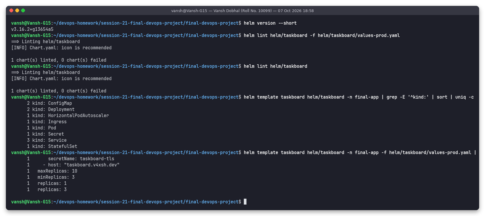

```bash
helm upgrade --install taskboard helm/taskboard -n final-app --create-namespace --wait
```

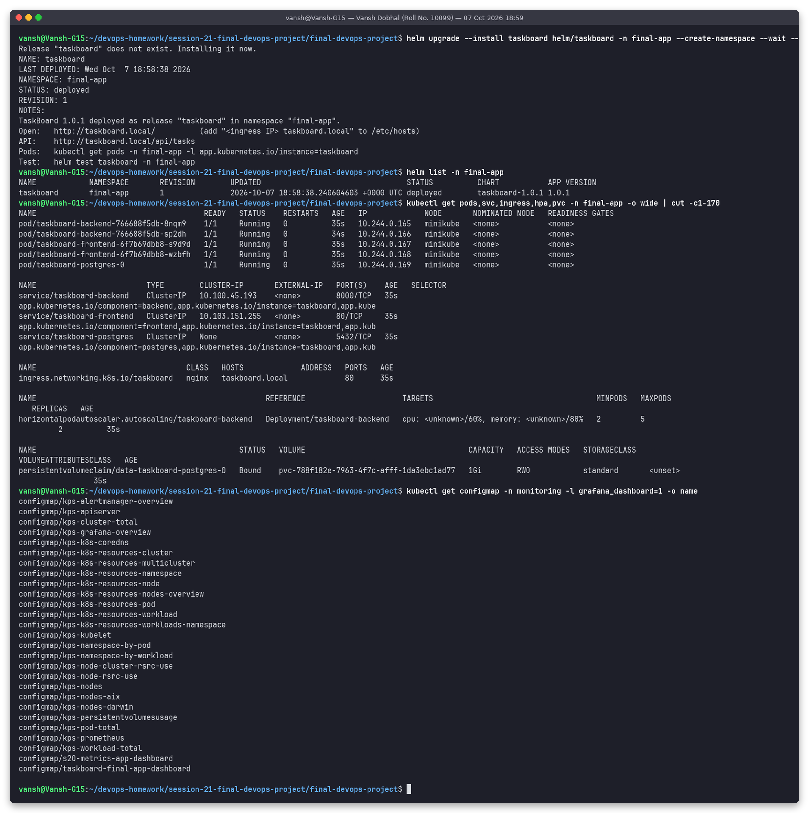

`helm test` passed (the smoke pod read `/health`, `/ready`, `/api/tasks/stats` and the frontend `/healthz`). I then exercised the API through the Ingress with `curl -H 'Host: taskboard.local' http://$(minikube ip)/...`: three POSTs, a PUT that marked task 1 as DONE, and stats showing `{"total":3,"todo":2,"inProgress":0,"done":1}`. A request for `/metrics` through the Ingress is served by the frontend SPA (text/html), so the backend metrics are not publicly exposed.

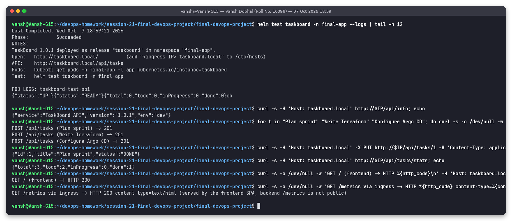

The real UI through the Ingress (Chromium resolved `taskboard.local` to the minikube IP, which is the same as an `/etc/hosts` entry):

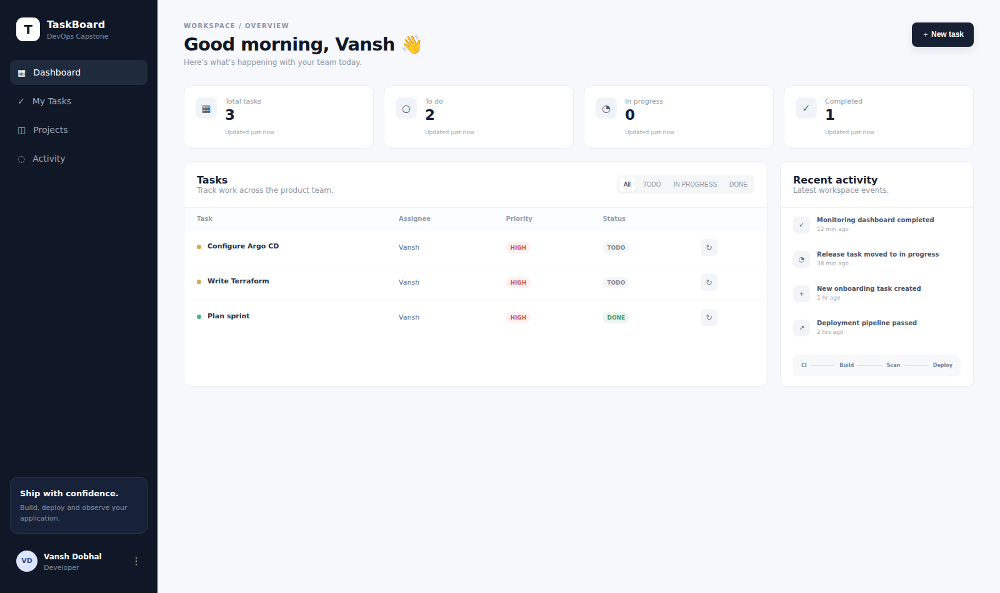

### HPA under load

`scripts/loadgen-pod.yaml` runs 30 parallel `wget` loops against the backend Service.

* Backend CPU went to 107-146m per pod (requests are 100m).
* The HPA reported `cpu: 432%/60%` and scaled **2 → 5** (its max).
* After the load stopped it reported `cpu: 3%/60%` and started scaling down (**5 → 4**, `All metrics below target`). It goes down gradually because of the 60 s `stabilizationWindowSeconds`.

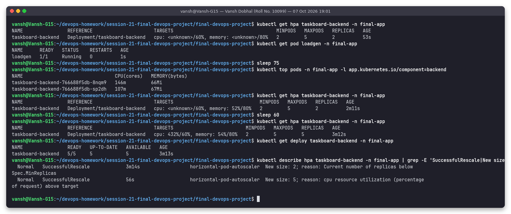
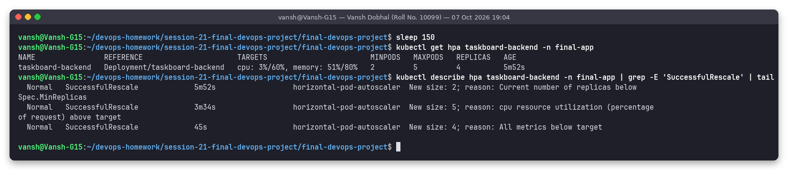

## 9. Terraform infrastructure

The files are in `terraform/`, written as plain resources (not modules) so every object is visible:

| File | Resources |
|------|-----------|
| `vpc.tf` | VPC `10.20.0.0/16`, 2 public + 2 private subnets in 2 AZs (with ELB role tags), IGW, 1 NAT gateway + EIP, public/private route tables, locked-down default security group |
| `eks.tf` | IAM roles for the cluster and nodes (+ policy attachments), KMS key for **Secrets envelope encryption**, EKS 1.33 cluster (private endpoint by default, public only if `cluster_endpoint_public_access = true` with explicit CIDRs), control-plane logs (api/audit/authenticator), managed node group `t3.medium` 1/2/3 in the private subnets |
| `registry-storage.tf` | 2 ECR repos (immutable tags, scan-on-push, lifecycle keeps 20), S3 artifacts bucket (versioning, **SSE-KMS** with a rotating CMK, public access block, BucketOwnerEnforced, lifecycle rules) |
| `providers.tf` | one provider block that targets real AWS or LocalStack (`use_localstack`) |
| `variables.tf` / `outputs.tf` | everything parameterised; outputs include the subnet IDs, ECR URLs and the `aws eks update-kubeconfig` command |
| `terraform.tfvars.example` | sample variables (no credentials) |

**What ran for real:**

1. `terraform fmt -check`, `terraform init -backend=false` and `terraform validate`. All succeeded. The provider lock file (`.terraform.lock.hcl`) is committed.

   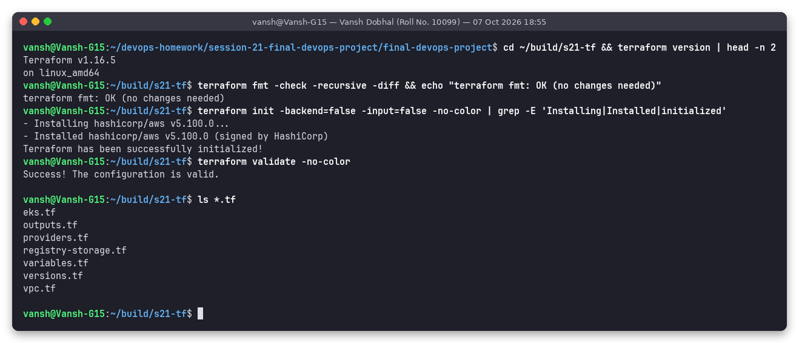

2. A **full `terraform plan` of all 37 resources**, including EKS and ECR. The provider pointed at LocalStack with fake credentials. A plan of new resources only needs the provider to start, so this plan is complete and accurate: VPC, subnets, NAT, the EKS cluster `taskboard-cluster` v1.33, a node group of `t3.medium` (desired 2, min 1, max 3), ECR and S3/KMS.

   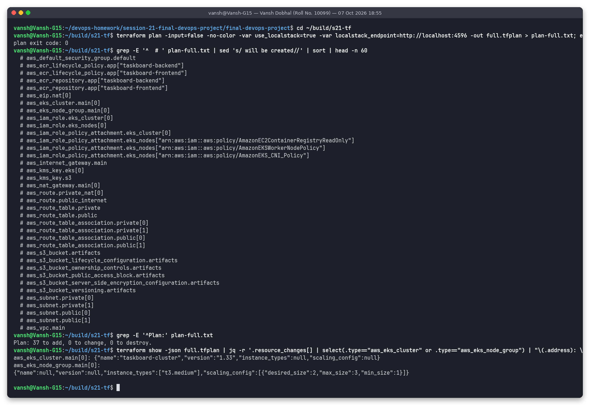

3. A **real `terraform apply` against LocalStack 4.9**. LocalStack community does not implement EKS or ECR, so `localstack.tfvars` sets `create_eks = false` and `create_ecr = false`. The VPC, 4 subnets, IGW, NAT/EIP, routes, KMS and the S3 bucket and its settings were created (**24 resources**).
   * **Bug found by the first apply:** S3 rejected the default tag `Owner = "Vansh Dobhal (10099)"` with `InvalidTag: The TagValue you have provided is invalid`, because parentheses are not allowed in S3 tag values. The same error would happen on real AWS. I changed the tag to `vansh-dobhal-10099`.

   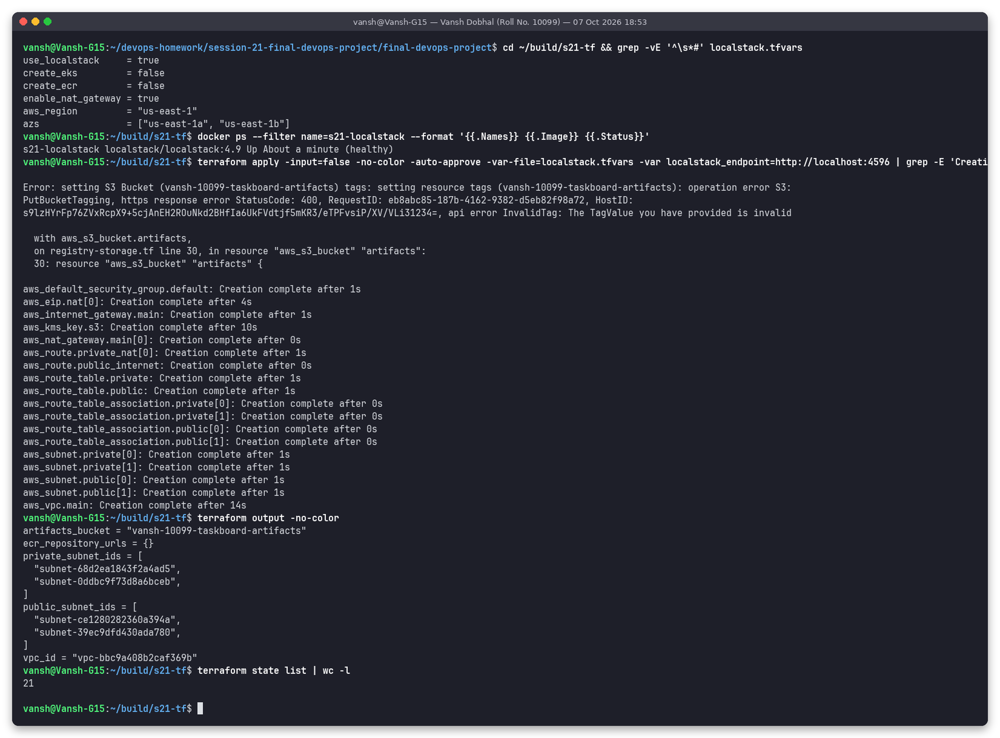
   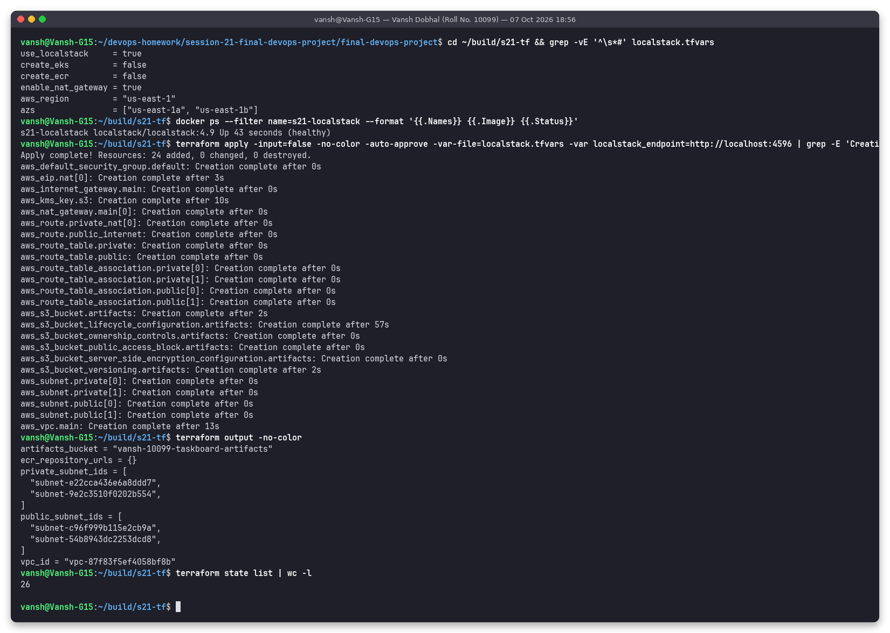

4. **Verify and destroy.** I checked with the AWS CLI against LocalStack: the subnets are in the right AZs, bucket versioning is `Enabled`, and encryption is `aws:kms` with the CMK. Then `terraform destroy` removed **24 resources** and the state was empty.

   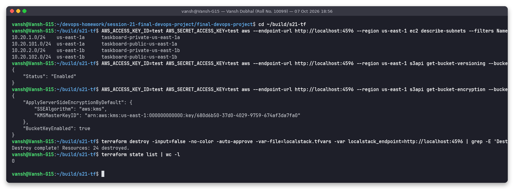

**Not done:** nothing was applied to a real AWS account, because there is no account or budget in this environment. To apply it for real: `cp terraform.tfvars.example terraform.tfvars && terraform init && terraform plan -out tfplan && terraform apply tfplan`, then `aws eks update-kubeconfig ...` and the same `helm upgrade --install` (with images in ECR or GHCR).

## 10. CI/CD pipeline

The workflow is `.github/workflows/final-pipeline.yml`. GitHub only runs workflows from the repository root, so an identical copy lives at **`devops-homework/.github/workflows/session21-final-pipeline.yml`**. That copy:
* triggers on push and pull requests to `main`, filtered to `session-21-final-devops-project/**`, plus `workflow_dispatch`;
* has `defaults.run.working-directory` set to this project;
* uses `concurrency` to cancel superseded runs.

| Stage | Job | What it does | Fails when |
|-------|-----|--------------|------------|
| 0 | `test` | setup-python 3.12, `ruff check`, `pytest --cov --cov-fail-under=80`, JUnit report artifact | lint error, failing test, coverage < 80% |
| 0 | `frontend` | Node 22, `npm ci`, `vite build` | build error |
| 0 | `sast` | bandit with `security/bandit.yaml`, `-ll -ii` | medium+ severity finding |
| 0 | `sca` | pip-audit `--strict`, `npm audit --audit-level=high`, `trivy fs` (lock files), `trivy config` (Dockerfiles, K8s, Helm, Terraform) | any known vuln / HIGH+ misconfig |
| 0 | `secrets` | gitleaks 8.28 `dir` scan with `security/gitleaks.toml` | any leak |
| 1 | `build-and-scan` | `docker build` both images tagged with **`${GITHUB_SHA}`**, `trivy image --ignore-unfixed --severity HIGH,CRITICAL --exit-code 1`, then saves the images as an artifact | fixable HIGH/CRITICAL CVE |
| 2 | `security-gate` | `if: always()`; checks the result of all 6 previous jobs | any of them is not `success` |
| 3 | `push` | only on `push` to `main`: `docker login ghcr.io` with `GITHUB_TOKEN` (`packages: write`), pushes the SHA tags | n/a |
| 3 | `deploy-kind` | creates a kind cluster on the runner, loads the SHA images, `helm lint`, `helm upgrade --install --wait`, `helm test --logs`, a curl smoke test (creates a task), debug dump on failure | unhealthy release or failed test |

The first time this repository is pushed, GitHub will run the pipeline. Until then, I ran it locally with `act`. The result is shown in section 11.4.

## 11. DevSecOps implementation

### 11.1 Shift-left checks

| Check | Tool | Scope | Result (final, 1.0.1) |
|-------|------|-------|----------------------|
| SAST | bandit 1.9.4 | `application/backend/app` (195 LOC) | 0 issues |
| SCA (Python) | pip-audit 2.10.1 | `requirements.txt` | no known vulnerabilities |
| SCA (JS) | npm audit | `package-lock.json` | 0 vulnerabilities |
| SCA (lock files) | Trivy 0.75 fs | `application/` | clean |
| IaC misconfig | Trivy config | Dockerfiles, `kubernetes/`, Helm chart, Terraform, troubleshooting/gitops manifests | 0 HIGH/CRITICAL |
| Secrets | gitleaks 8.21 | whole project | no leaks (and a planted fake GitHub token *is* detected, proving the scanner works) |
| Container CVEs | Trivy image | both images | 0 fixable HIGH/CRITICAL |

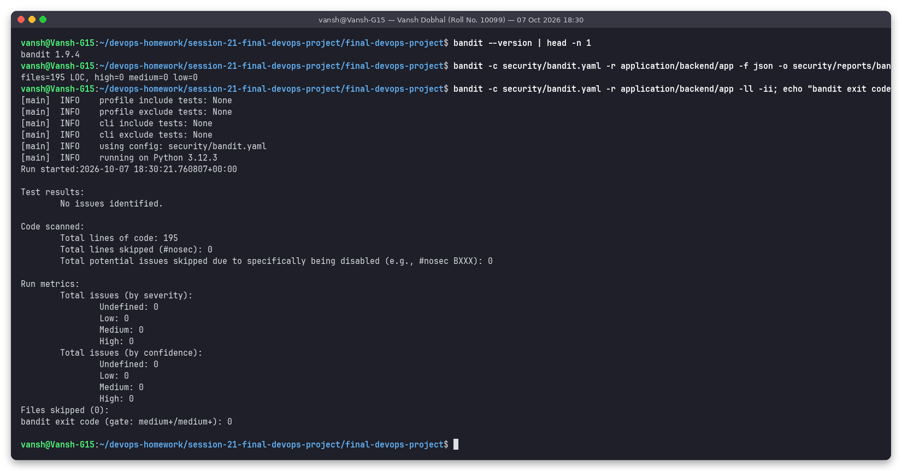
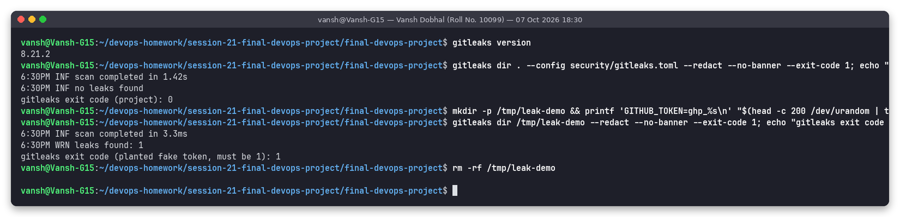

### 11.2 The gate failed first, and I fixed what it found

This is the most useful part of the project: the first run of the security gate on **1.0.0** **failed**.

**Dependency scan (SCA)**
* `pip-audit` found **10 advisories in `starlette 0.49.3`**. Starlette was pulled in transitively by fastapi 0.120.x. The advisories include Host-header URL reconstruction (PYSEC-2026-161), path validation (PYSEC-2026-248), and `request.form()` limits not enforced (PYSEC-2026-249), with fixes in 1.0.1-1.3.1.
* `npm audit` flagged **vite 7.1.12** (HIGH, dev-server path traversal / `server.fs.deny` bypass).

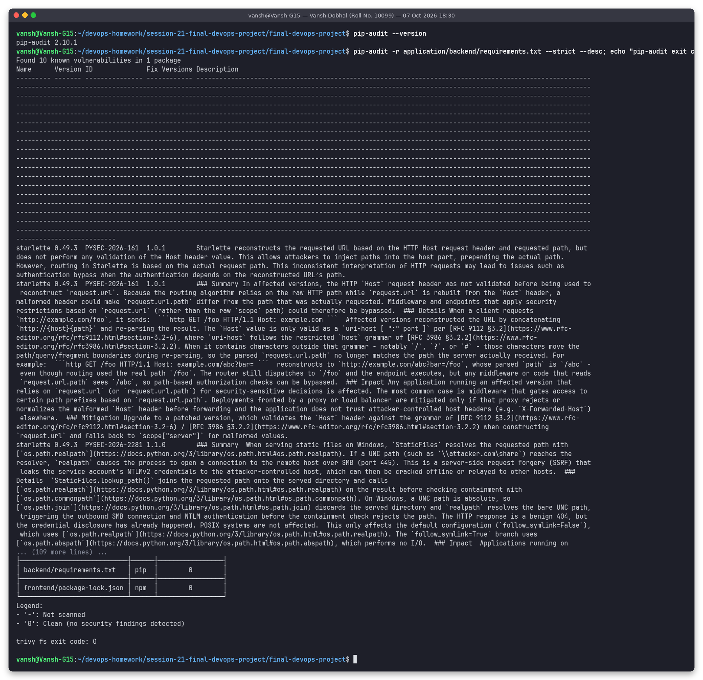

**Image scan**
* Trivy found **6 fixable HIGH** issues in the backend image: starlette CVE-2026-54283, and urllib3 2.7.0 CVE-2026-97687/97689 inside the pip that was left in the venv.

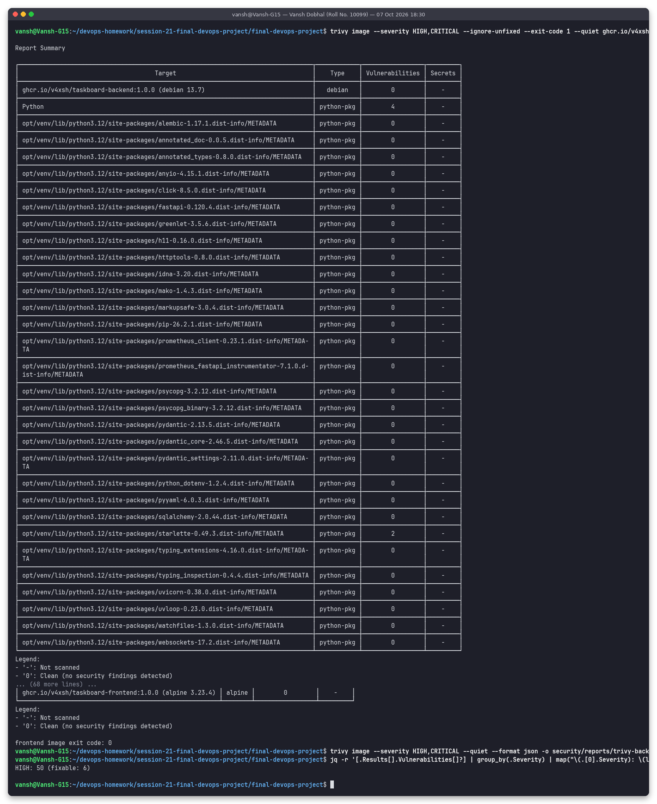

**IaC scan**
* Trivy config found CRITICAL `AWS-0040/0041` (the EKS API was public to `0.0.0.0/0`).
* It found HIGH `AWS-0132` (the S3 bucket had no customer-managed KMS key).
* It found HIGH `KSV-0014/0118` (PostgreSQL and Gitea containers had a writable root FS and the default security context).

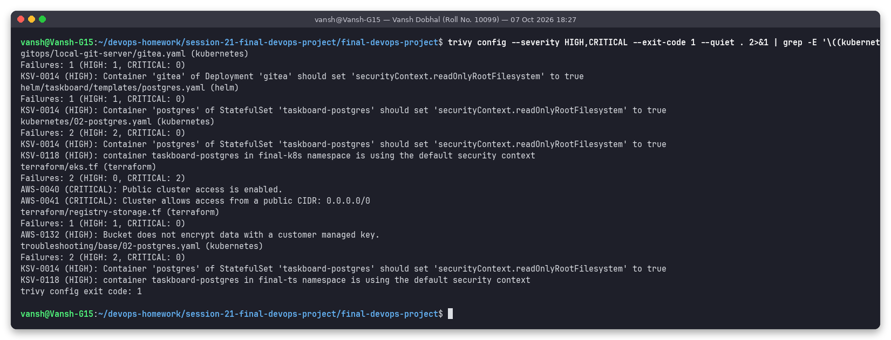

The gate summary for 1.0.0:

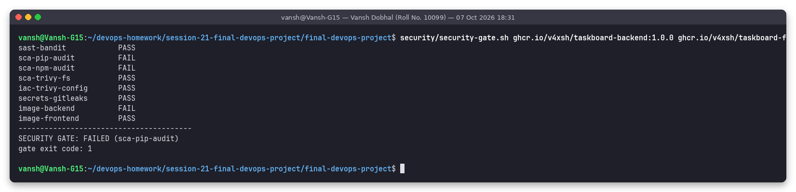

**Fixes**

| Finding | Fix |
|---------|-----|
| starlette advisories | fastapi 0.120.4 → **0.142.2**, explicit pin **starlette 1.7.0**, prometheus-fastapi-instrumentator 7.1.0 → **8.1.0** (the first release that supports starlette 1.x; 7.1.0 made pip report `ResolutionImpossible`) |
| vite | vite → **7.3.7**, @vitejs/plugin-react → 5.2.0 (same major version, so no breaking change), lock file regenerated |
| urllib3 in image | `pip uninstall -y pip` at the end of the builder stage, so the venv ships without pip and its vendored libraries |
| EKS public endpoint | new variable `cluster_endpoint_public_access` (default `false`); CIDRs only used when it is enabled |
| S3 encryption | new `aws_kms_key.s3` with rotation; bucket uses `aws:kms` + bucket key |
| Postgres / Gitea | `runAsNonRoot`, `runAsUser: 70` (Postgres), `readOnlyRootFilesystem: true`, `capabilities: drop [ALL]`, emptyDir for socket/tmp, seccomp RuntimeDefault |
| loadgen pod (found on the next run) | same hardening |

After the fixes, the tests still pass (12/12) and the release is 1.0.1:

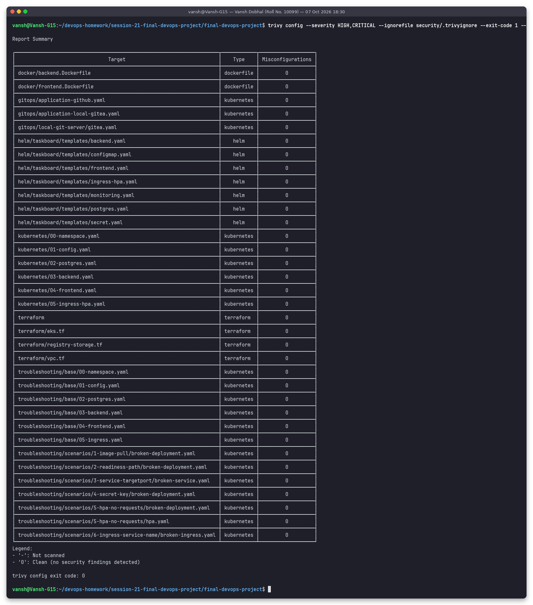
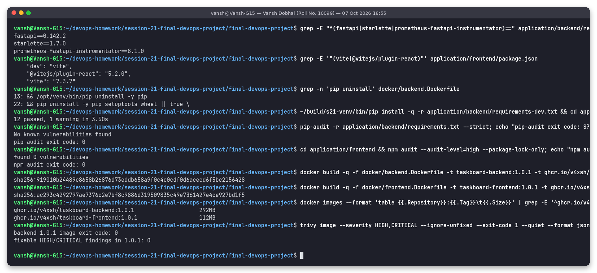

The gate passes with **all 8 checks green**:

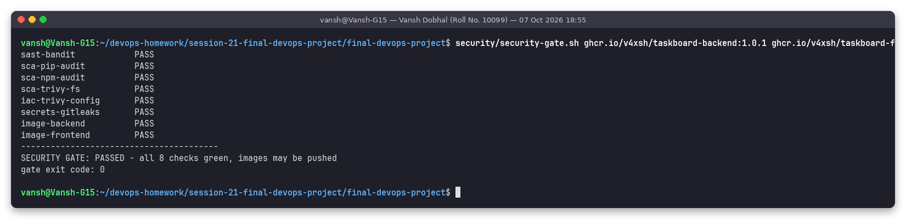

**Observation:** `trivy fs` reported the frontend lock file as clean while `npm audit` flagged vite. Different scanners use different advisory sources and coverage, which is why the pipeline runs both.

### 11.3 Runtime hardening built into the manifests and chart

* Non-root UIDs everywhere, `allowPrivilegeEscalation: false`, `readOnlyRootFilesystem: true`, `capabilities: drop: [ALL]`, `seccompProfile: RuntimeDefault`, `automountServiceAccountToken: false`.
* Secrets come only through `secretKeyRef`. The Helm chart generates the password and never prints it. Production uses `existingSecret`.
* Resource requests and limits on every container (this also makes the HPA work).
* Only `/` and `/api` are routed by the Ingress. `/metrics`, `/health` and `/ready` stay cluster-internal.
* Nginx sends `X-Content-Type-Options`, `X-Frame-Options DENY` and `Referrer-Policy`, and hides its version with `server_tokens off`.
* ECR uses immutable tags, and the pipeline tags images with the git SHA (never `latest`).

### 11.4 Pipeline run locally with `act`

`scripts/10-act-pipeline.sh` copies the project into a throw-away git workspace (`/tmp/act-ws`, with the same layout as the real repo) and runs the root workflow with `act pull_request` on the `catthehacker/ubuntu:act-latest` runner image. The event payload contains `"act": true`, so `push` (needs a GHCR token) and `deploy-kind` (needs kind inside the runner) are skipped. Artifact upload steps are skipped through `env.ACT`.

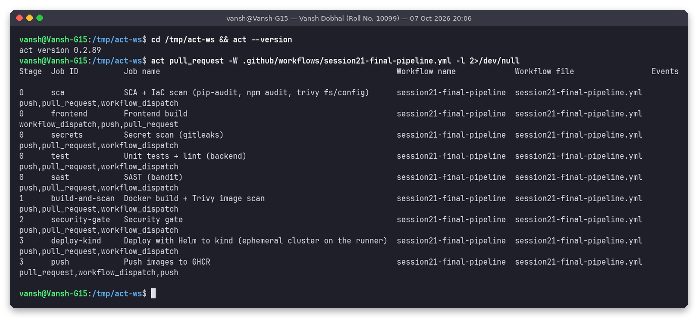

**The first local run failed.** It surfaced two problems:
1. **npm hung for 20+ minutes.** act uses the host network by default, and IPv6 on this WSL host has no working route, so npm stalled on AAAA records. The fix was `--network bridge` plus `NODE_OPTIONS=--dns-result-order=ipv4first`.
2. **The `Install Trivy` step failed.** The release assets for the pinned **Trivy 0.67.2** can no longer be downloaded (`found version: 0.67.2` and then exit 1). I bumped the pin to **0.75.0** in both workflow copies.

The full failed log is kept in `security/reports/act-run-1-trivy-install-failed.log`.

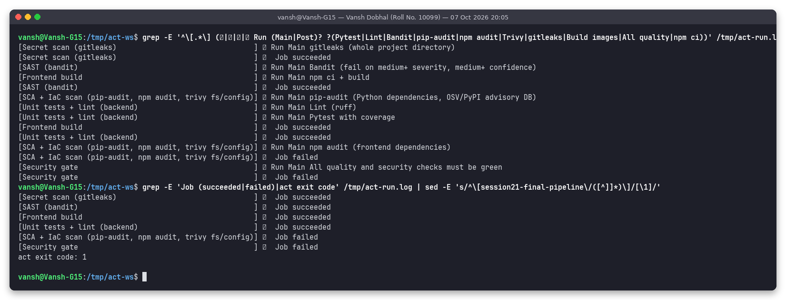

**The second run passed.** All 7 jobs that can run locally succeeded and `act` exited with code 0:
* `test`: ruff, 12 passed, coverage 98.31% ≥ 80%
* `frontend`, `sast` (No issues identified), `secrets` (no leaks found)
* `sca`: pip-audit "No known vulnerabilities found", npm audit "found 0 vulnerabilities", trivy fs + trivy config
* `build-and-scan`: both images built with the commit-SHA tag and scanned by Trivy
* `security-gate`: "security gate PASSED - image may be published"

The full log is in `security/reports/act-run.log`.

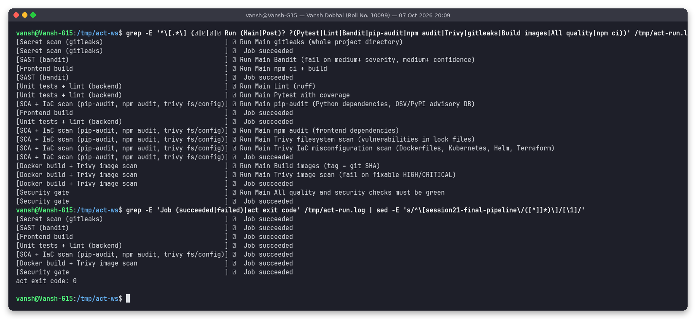
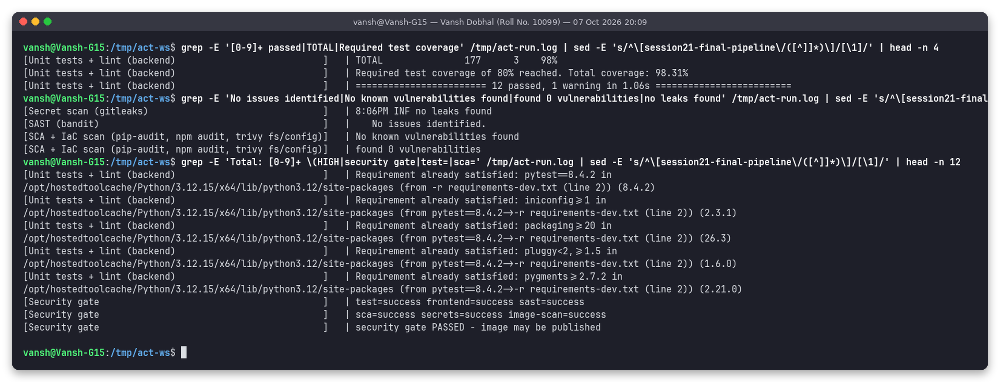

> **Label:** this is a local `act` run, not a GitHub-hosted run. On GitHub the same workflow will also run `push` (GHCR, with `GITHUB_TOKEN`) and `deploy-kind` once the repository is pushed.

## 12. Monitoring

This reuses the kube-prometheus-stack from session 20 (namespace `monitoring`, values copied to `monitoring/kube-prometheus-stack-values.yaml`). The chart adds:

* **ServiceMonitor** `taskboard-backend`: scrapes every backend pod's `/metrics` every 15 s.
* **PrometheusRule** `taskboard-alerts` with five rules:
  * `TaskboardBackendDown` (`absent(up==1)` for 1m)
  * `TaskboardHigh5xxRate` (> 5% for 5m)
  * `TaskboardHighLatencyP95` (> 500 ms for 5m)
  * `TaskboardPodRestarting` (> 3 restarts in 15m)
  * `TaskboardDatabaseNotReady` (StatefulSet ready replicas < 1)
* **Grafana dashboard as code** (`helm/taskboard/dashboards/taskboard.json`, rendered copy in `monitoring/grafana-dashboard-taskboard.json`). Panels: targets up, req/s, 5xx ratio, tasks created, HPA replicas, request rate by handler, latency p50/p95/p99, CPU and memory per pod.

`monitoring/taskboard-monitoring-rendered.yaml` contains the exact objects that Helm rendered for the `final-app` release.

Prometheus scrapes all backend replicas (`up`). The raw `/metrics` output contains `http_requests_total{handler="/api/tasks",method="GET",status="2xx"} 8578` from the load test and `taskboard_tasks_created_total{priority="HIGH"}`:

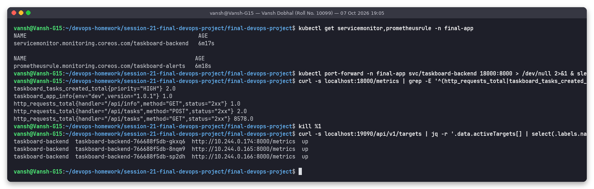

PromQL over the last 30 minutes:
* ~20.9k `GET /api/tasks` requests
* p95 latency 414 ms (measured under the 30-way load test)
* 3 tasks created with HIGH priority
* the HPA peaked at 5 replicas
* memory per pod (backend ~64-68 MiB, Postgres ~60 MiB, frontend ~10 MiB)
* all 5 alert rules loaded, `inactive` and `ok`

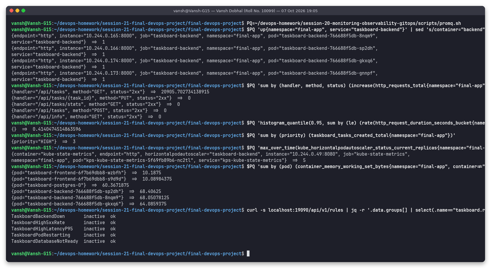

Real captures of the Prometheus targets page, the alert rules page and the Grafana dashboard. The "5xx ratio" panel shows *No data* because the app never returned a 5xx, so the `status="5xx"` series does not exist yet.

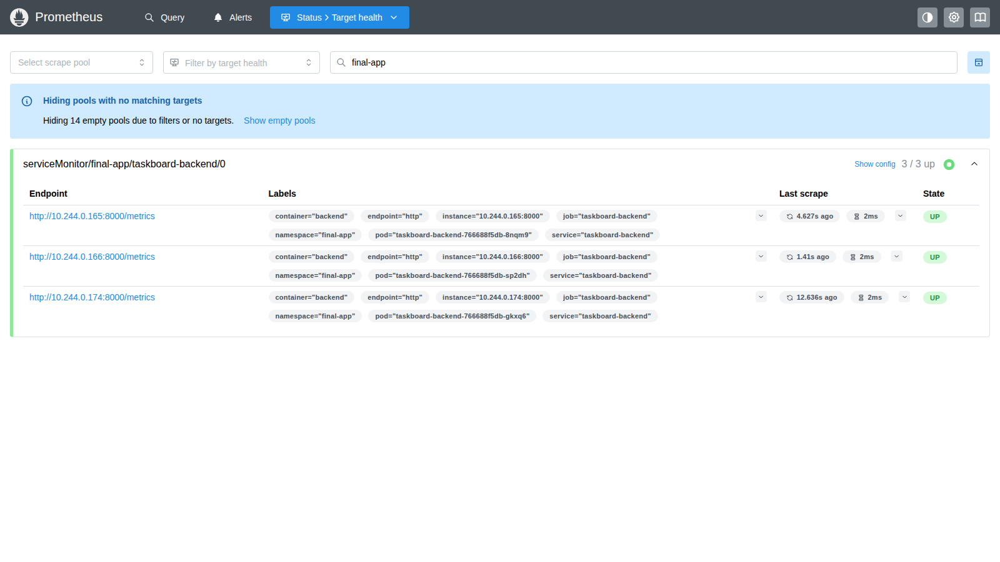
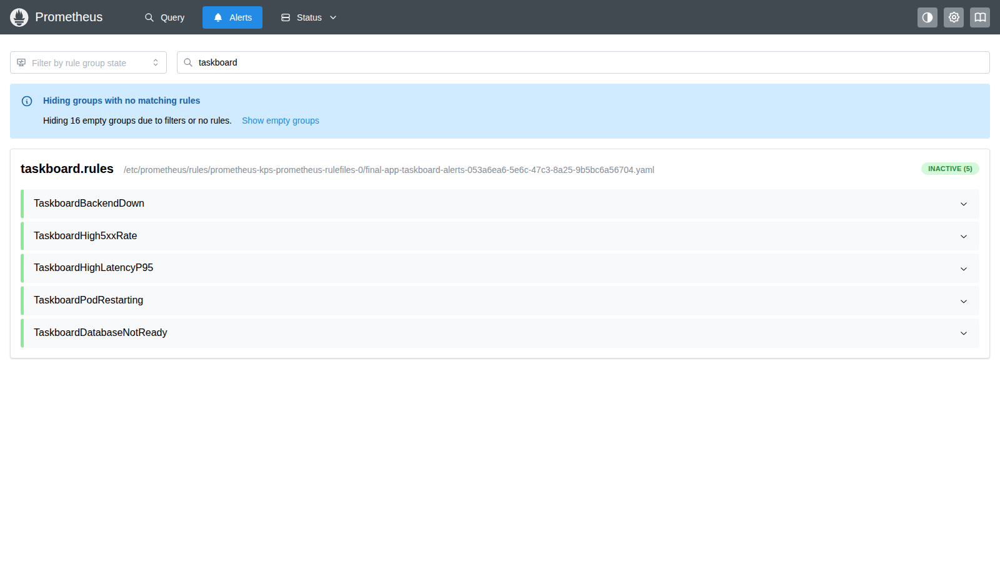
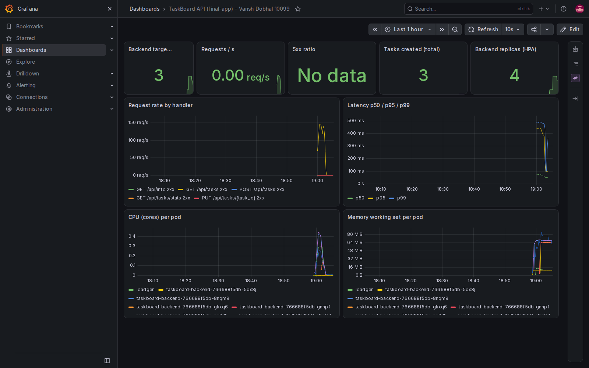

## 13. GitOps

**Goal:** Argo CD should deploy the Helm chart from Git, and the only way to change the deployment should be a commit.

**Problem:** this project's GitHub repo (`v4xsh/devops-homework`) has not been pushed yet, so Argo CD cannot pull from it.

**Solution for a real, complete demo:** I ran a throw-away **Gitea** server inside the cluster (`gitops/local-git-server/gitea.yaml`, namespace `final-gitea`, hardened, no persistence) to play the role of GitHub. I copied the chart into a *practice* repository at `~/practice/taskboard-gitops` and committed there. No commits were made in the submission repo.

1. Gitea started, a user was created, and the repo `vansh/taskboard-gitops` was created through the API.

   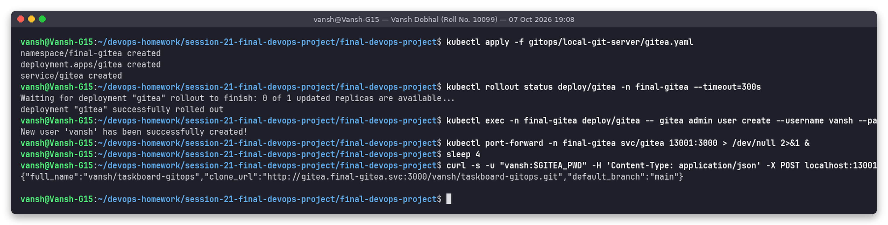

2. First commit pushed: `Add TaskBoard Helm chart (1.0.1) for Argo CD`. (The last line of this screenshot is a `jq` error from my commit-listing command against the Gitea API; the push itself succeeded, as the `* [new branch] main -> main` line shows.)

   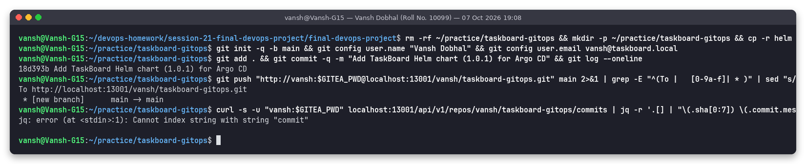

3. I applied `gitops/application-local-gitea.yaml`: Helm source `helm/taskboard` with `values-gitops.yaml`, automated prune + self-heal, `CreateNamespace`. Argo CD rendered the chart and created ConfigMap, 3 Services, 2 Deployments, the StatefulSet, Ingress, ServiceMonitor and PrometheusRule. The app became **Synced to main (18d393b)** and **Healthy**. The DB password Secret was created beforehand with `kubectl create secret ... --from-literal=db-password=$(openssl rand -hex 16)`, so no secret is stored in Git.

   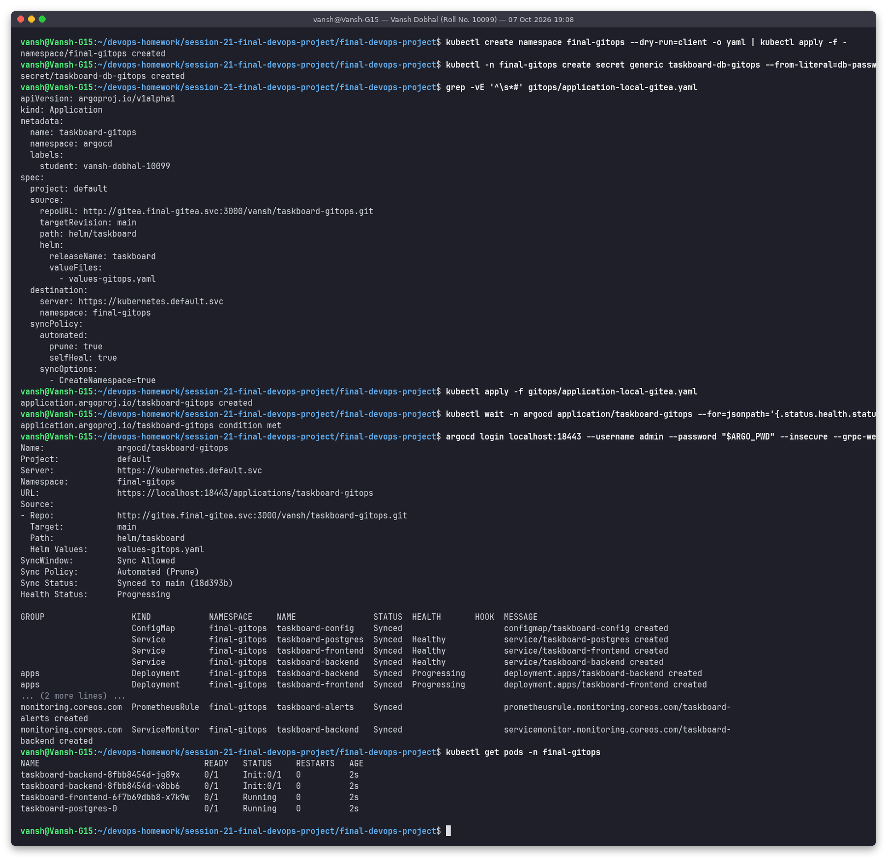

4. **Change through a commit.** I changed `replicaCount` from 2 to 3 in `values-gitops.yaml` and pushed `a136a9d Scale TaskBoard backend to 3 replicas`. Argo CD synced the new revision and the backend rolled out to **3/3**. `argocd app history` shows both revisions.

   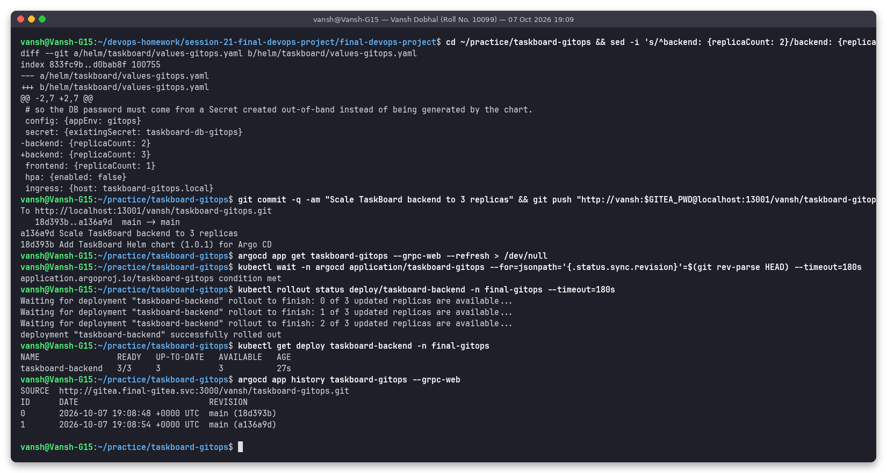

5. **Self-heal and rollback through Git.**
   * `kubectl scale --replicas=1` was reverted by Argo CD within 15 s (back to 3/3).
   * `git revert` (`fd43aa4`) and a push brought the Deployment back to **2/2**. The app ended Synced and Healthy at `fd43aa4`.

   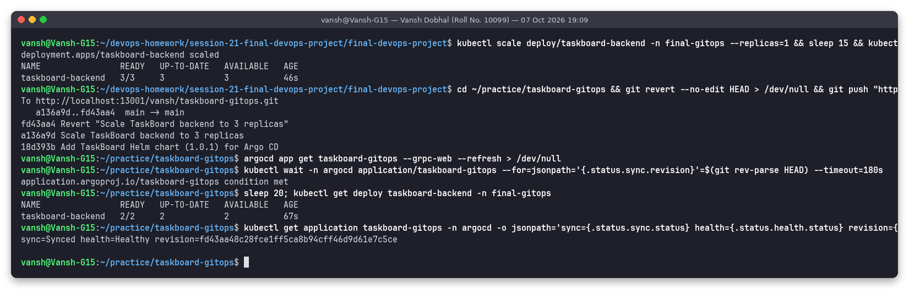

The real Argo CD UI shows the commit author and message (`Revert "Scale TaskBoard backend to 3 replicas"`) and the full resource tree, including the PVC:

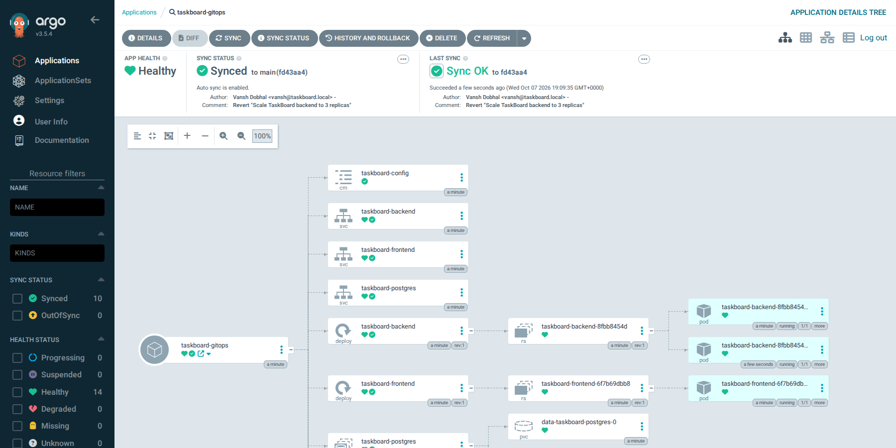
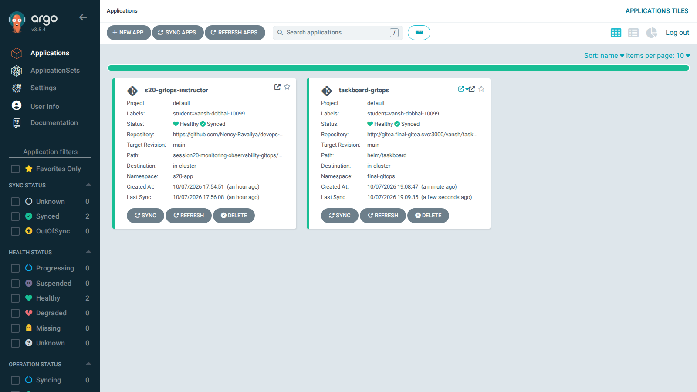

**After pushing to GitHub**, use `gitops/application-github.yaml`. It points at `https://github.com/v4xsh/devops-homework.git`, path `session-21-final-devops-project/final-devops-project/helm/taskboard`. The commands are in the file header (create the namespace and the DB Secret, then `kubectl apply`). From then on, the CI pipeline pushes `:sha` images, and a commit that bumps `backend.image.tag` in `values-gitops.yaml` triggers the deployment.

## 14. Final Troubleshooting Challenge

**Setup:** a working copy of the stack (`troubleshooting/base/`, namespace `final-ts`, ingress host `taskboard-ts.local`). I introduced **six** faults, one at a time.

**Files:** each broken file is in `troubleshooting/scenarios/<n>/` and starts with a `# BROKEN ON PURPOSE` comment that names the fault.

**Method for each fault:** observe the symptom, investigate with real commands, find the root cause, fix by re-applying the correct base manifest, then verify. Script: `scripts/09-troubleshooting.sh`, with a second pass for scenarios 3 and 5 in `09b-troubleshooting-rerun-3-5.sh`.

Baseline (everything healthy, `GET /api/tasks` → 200):

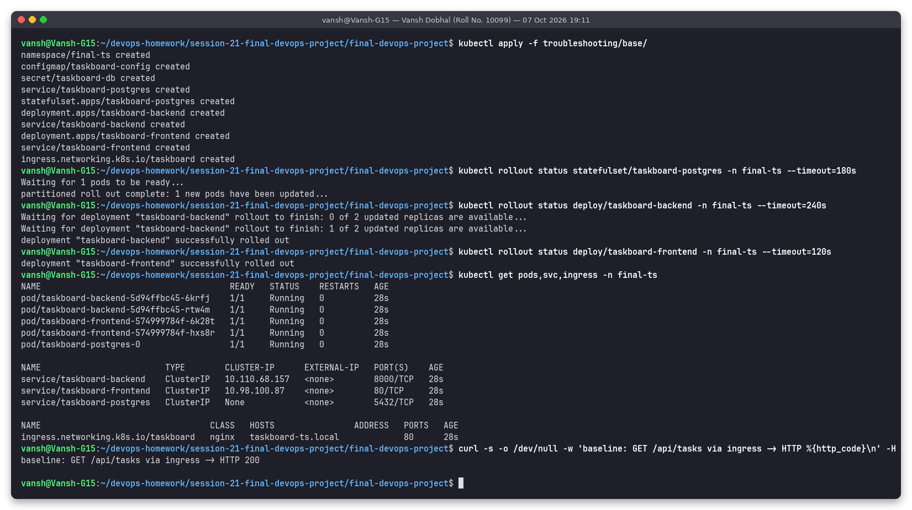

### Issue 1: wrong image tag → `ImagePullBackOff`

* **Symptom:** a new pod is stuck in `Init:ErrImagePull` / `ImagePullBackOff`, and `rollout status` times out. The two old pods keep serving traffic, because `maxUnavailable: 0` means a bad rollout never takes capacity away.
* **Investigation:**
  * `kubectl describe pod` → `Failed to pull image "ghcr.io/v4xsh/taskboard-backend:1.0.2"` → `Back-off pulling image`.
  * The init container fails first because it uses the same image.
* **Root cause:** tag `1.0.2` was never built or pushed. Only `1.0.1` exists (`minikube image ls`).
* **Fix:** set the tag back to `1.0.1`, `kubectl apply`.
* **Verify:** rollout successful, both pods on `1.0.1`, ready.

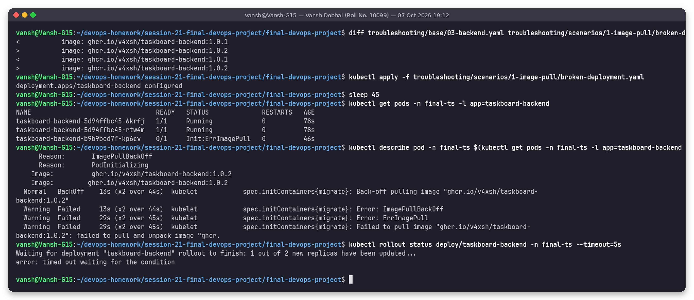
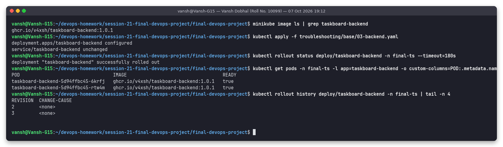

### Issue 2: wrong readiness probe path → pods never Ready, no endpoints, 503

* **Symptom:** pods are `Running` but `0/1`, and the Ingress returns **503 Service Temporarily Unavailable**.
* **Investigation:**
  * The EndpointSlice lists both pod IPs with `ready=false`.
  * Events show `Readiness probe failed: HTTP probe failed with statuscode: 404`.
  * The app's own JSON log shows `"path": "/readyz", "status": 404`.
* **Root cause:** the probe path is `/readyz`, but the app serves `/ready`.
* **Fix:** correct the path.
* **Verify:** pods are 1/1, endpoints are `ready=true`, `GET /api/tasks` → 200.

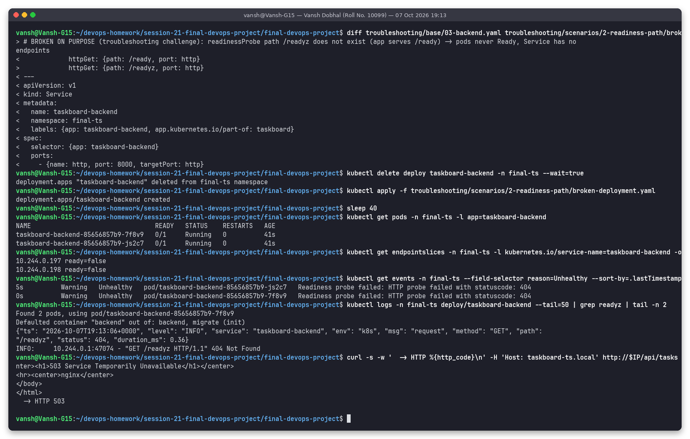
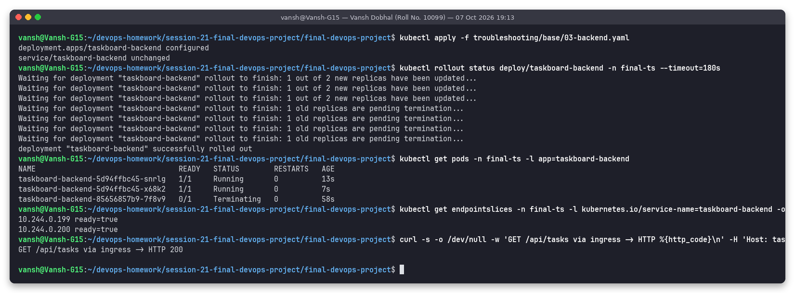

### Issue 3: Service `targetPort` mismatch → 502

* **Symptom:** pods are healthy and Running, but the Ingress returns **502 Bad Gateway**.
* **Investigation:**
  * The Service shows `port=8000 targetPort=8080`.
  * The container port is `{"containerPort":8000,"name":"http"}`.
  * The EndpointSlice port is `8080`.
  * The ingress-nginx log shows `connect() failed (111: Connection refused) while connecting to upstream`.
* **Root cause:** traffic is sent to a port nothing listens on.
* **Fix:** use `targetPort: http` (the named port), so it can never drift from the container spec again.

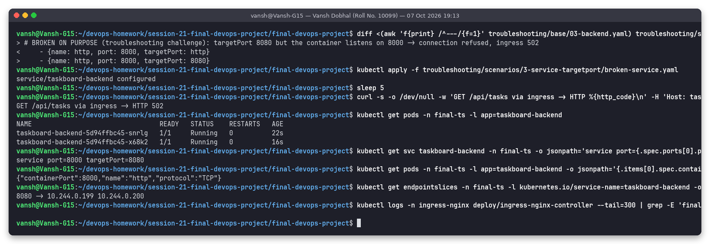

**A second problem showed up during verification.** After the Service fix, the EndpointSlice correctly showed port **8000**, but the Ingress *still* returned 502:
* immediately after the fix (`ts3b`);
* and on a second pass, for **36 attempts over 3 minutes** (`ts3c`).

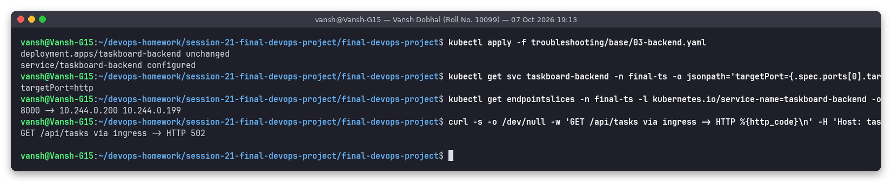
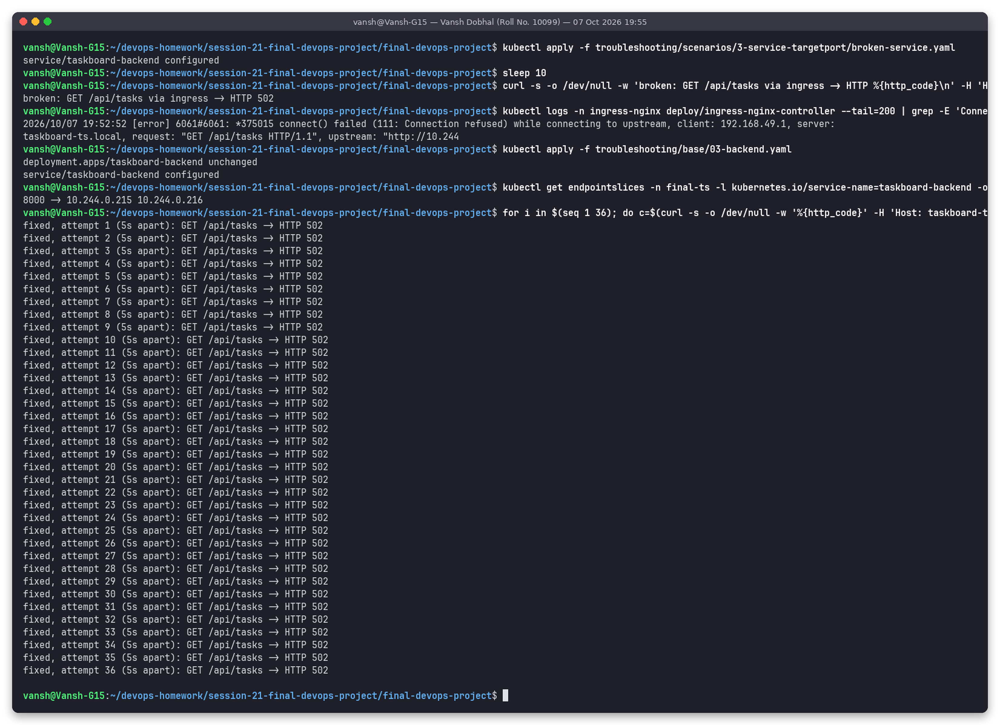

To find out why, I looked inside ingress-nginx with its built-in debug tool: `kubectl exec <controller> -- /dbg backends get final-ts-taskboard-backend-http` (`ts3d`).
* The controller's **live upstream list still contained `10.244.0.224:8080` and `10.244.0.225:8080`**, even though the EndpointSlice already said 8000.
* In this minikube ingress-nginx build, a change of *only the port* on unchanged pod IPs was not pushed to the dynamic (Lua) backend configuration.
* A `kubectl rollout restart` of the backend created new pods with new IPs. The controller then picked up `10.244.0.229:8000` and `10.244.0.230:8000`, and `GET /api/tasks` returned **200**.

**Lesson:** after a port fix, check what the proxy actually uses (`/dbg backends`), not only the Kubernetes objects.

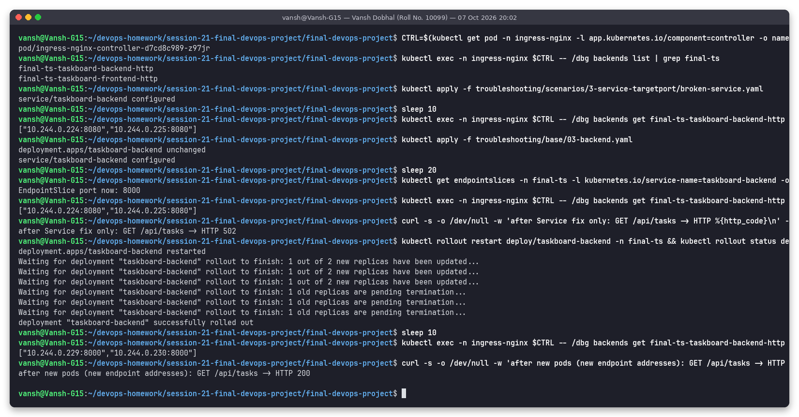

### Issue 4: missing Secret key → `CreateContainerConfigError`

* **Symptom:** a new pod is stuck in `Init:CreateContainerConfigError`. The old pods keep serving.
* **Investigation:**
  * The events say `Error: couldn't find key password in Secret final-ts/taskboard-db`.
  * Listing the Secret's keys shows only `db-password`.
* **Root cause:** the `secretKeyRef.key` has a typo (`password` instead of `db-password`).
* **Fix:** correct the key.
* **Verify:** the rollout completes and `GET /api/tasks` → 200.

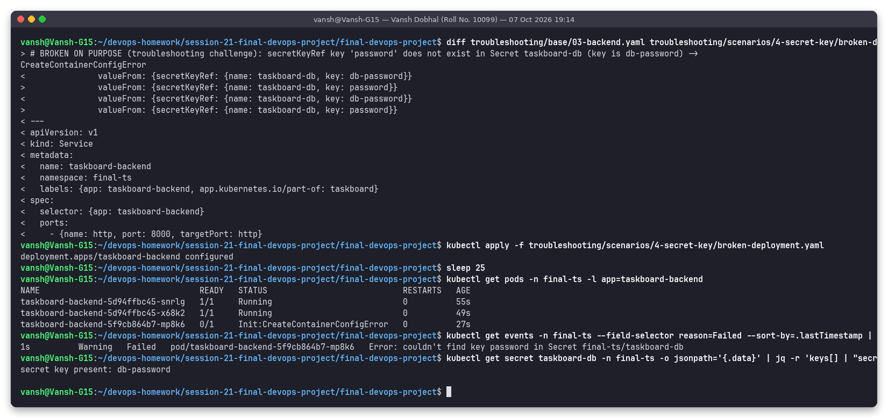
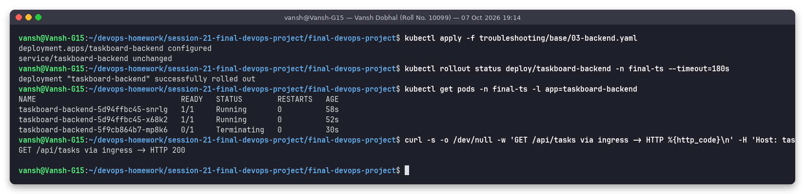

### Issue 5: HPA without resource requests → `<unknown>` targets

* **Symptom:** `kubectl get hpa` shows `cpu: <unknown>/70%` and the HPA never scales.
* **Investigation:**
  * The Deployment's `resources` is `{}`.
  * `kubectl describe hpa` shows `FailedGetResourceMetric`.
* **Root cause:** HPA utilisation is *usage ÷ request*. With no CPU request there is nothing to divide by. The second pass, with a longer wait, captures the exact message (`ts5c`): `failed to get cpu utilization: missing request for cpu in container frontend`.
* **Fix:** add `requests: {cpu: 20m, memory: 32Mi}` (plus limits).
* **Verify:** the HPA shows `cpu: 5%/70%` with `ScalingActive True ValidMetricFound`.

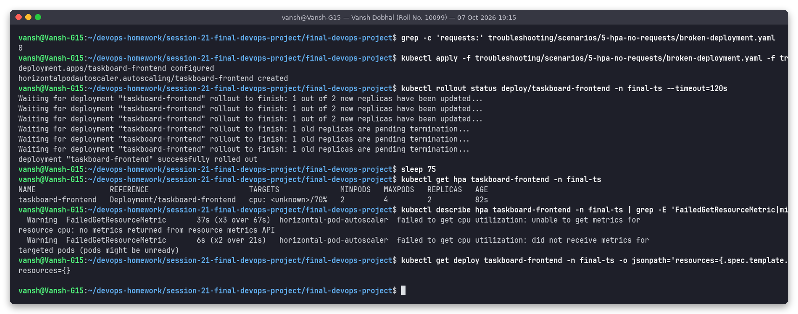
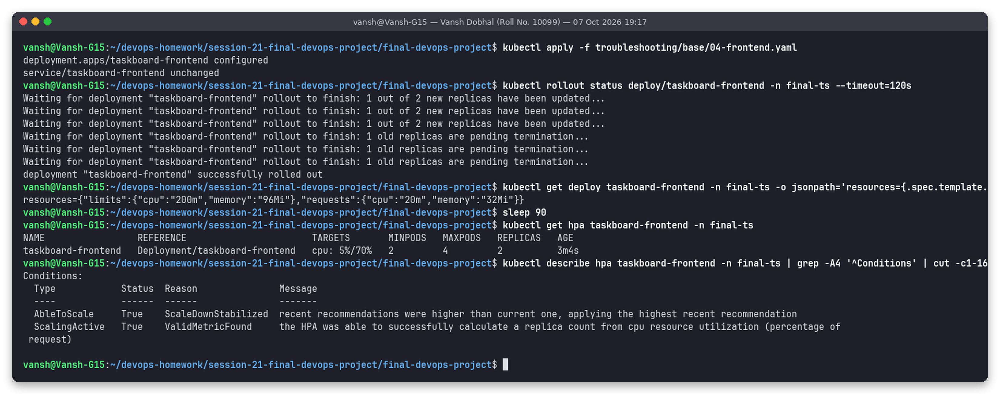
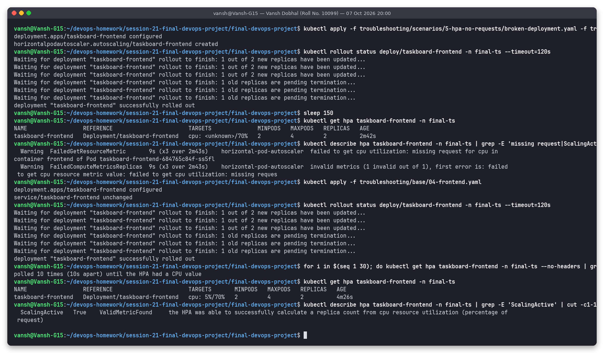

### Issue 6: Ingress points to a non-existent Service → 503

* **Symptom:** `/api/tasks` → **503**, but `/` (the frontend rule) is still 200.
* **Investigation:**
  * `kubectl describe ingress` shows `/api taskboard-api:http (<error: services "taskboard-api" not found>)`.
  * `kubectl get svc` lists only `taskboard-backend`, `taskboard-frontend` and `taskboard-postgres`.
* **Root cause:** the backend Service name in the Ingress rule is wrong.
* **Fix:** use `taskboard-backend`.
* **Verify:** the describe output shows backend endpoints `10.244.0.199/200:8000`, and `/api/tasks` → 200.

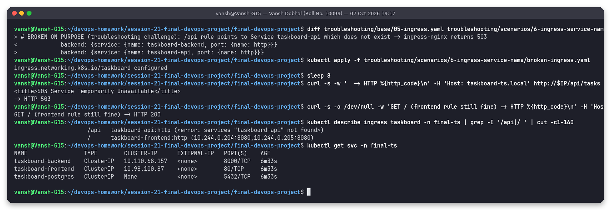
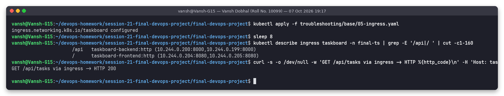

Final state, everything healthy:

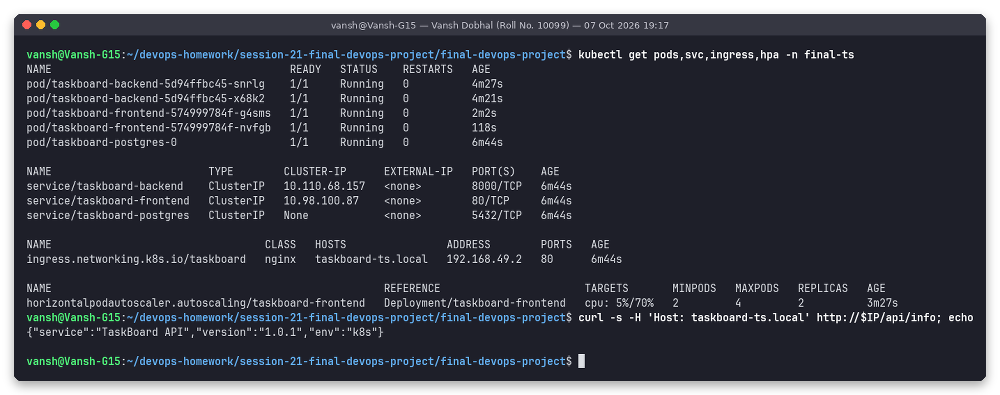

### Quick triage table I built from these cases

| Symptom | First command | Typical root cause |
|---------|---------------|--------------------|
| `ErrImagePull` / `ImagePullBackOff` | `kubectl describe pod` (Events) | wrong tag/registry, private registry without `imagePullSecrets` |
| `Running` but `0/1` | `kubectl get events --field-selector reason=Unhealthy` | wrong probe path/port, dependency down |
| Ingress 503 | `kubectl get endpointslices`, `kubectl describe ingress` | no ready endpoints / wrong Service name |
| Ingress 502 | compare Service `targetPort` with `containerPort`; ingress-nginx logs | port mismatch, app not listening |
| `CreateContainerConfigError` | `kubectl describe pod` | missing ConfigMap/Secret or key |
| HPA `<unknown>` | `kubectl describe hpa` | no resource requests, metrics-server not ready |

## 15. Screenshots index

| # | File | Shows |
|---|------|-------|
| 01-02 | `01-unit-tests`, `02-frontend-build` | ruff + 12 tests (98% coverage), Vite build |
| 03-04 | `03-docker-build`, `04-docker-compose` | multi-stage builds, non-root, compose stack |
| 05-12 | `05`…`12` | bandit, SCA findings, IaC before/after, gitleaks, Trivy image, gate FAILED, remediation, gate PASSED |
| 13-15 | `13`…`15` | images into minikube, plain manifests, verification |
| 16-20 | `16`…`20` | helm lint/template, install, helm test + ingress, HPA up/down |
| 21-24 | `21`…`24` (+`23a`) | terraform fmt/validate, full plan, LocalStack apply (first try + fixed), verify + destroy |
| 25-26 | `25`, `26` | metrics + scrape targets, PromQL + alert rules |
| 27-31 | `27`…`31` | Gitea, first commit, Argo CD sync, change via commit, self-heal + git revert |
| 32-34 | `32`, `33a`, `33`, `34` | act job list, first local run (failed: Trivy pin), passing local run, job details |
| browser | `screenshots/browser/*` | TaskBoard UI (compose + ingress), Prometheus targets/rules, Grafana dashboard, Argo CD tree/apps |
| ts0-ts7 | `troubleshooting/screenshots/*` | 6 issues: before/after (+ `ts3c`/`ts3d` ingress upstream deep dive, `ts5c` HPA rerun) |

## 16. How to reproduce

```bash
cd ~/devops-homework/session-21-final-devops-project/final-devops-project
bash scripts/01-app-test-build.sh        # tests, frontend build, images, compose
bash scripts/02-security-scans.sh        # bandit, pip-audit, npm audit, trivy fs/config/image, gitleaks, gate
bash scripts/03-remediate-and-regate.sh  # 1.0.1 rebuild + gate
bash scripts/04-kubernetes-manifests.sh  # plain manifests in final-k8s
bash scripts/05-helm-deploy.sh           # helm install final-app, helm test, ingress, HPA load test
bash scripts/06-terraform.sh             # validate, full plan, LocalStack apply/destroy
bash scripts/07-monitoring.sh            # needs session-20 kube-prometheus-stack + port-forwards
bash scripts/08-gitops.sh                # Gitea + Argo CD commit-driven sync (needs Argo CD from session 20)
bash scripts/09-troubleshooting.sh       # 6 broken/fixed scenarios
bash scripts/09b-troubleshooting-rerun-3-5.sh        # second pass for scenarios 3 and 5 (polling verification)
bash scripts/09c-troubleshooting-targetport-deep-dive.sh  # ingress-nginx /dbg upstream investigation
bash scripts/10-act-pipeline.sh          # pipeline locally with act
```

Prerequisites: minikube with the ingress + metrics-server addons, docker, helm, kubectl, terraform, trivy, gitleaks, act, Python 3.12 (venv with bandit, pip-audit, awscli, playwright), and Node 20+.

## 17. What was real and what was simulated

| Item | Status |
|------|--------|
| App, tests, Docker images, compose, scans, security gate | **real**, run locally |
| Kubernetes manifests, Helm release, Ingress, HPA scaling, PVC | **real**, on minikube |
| Prometheus scraping, alert rules, Grafana dashboard | **real** (session-20 stack) |
| Argo CD sync / self-heal / rollback from Git | **real**, but the Git server is an in-cluster Gitea because the GitHub repo is not pushed yet; `application-github.yaml` is ready for after the push |
| GitHub Actions | **real local run with `act`** (CI + security jobs + image build/scan + gate). `push` to GHCR and `deploy-kind` need GitHub's runner/token and run on the first real push |
| Terraform | `validate` + full 37-resource `plan` are **real**; `apply`/`destroy` are **real against LocalStack** (VPC, subnets, NAT, routes, KMS, S3). EKS and ECR are planned only (not in LocalStack community, and there is no AWS account) |

## 18. Lessons learned

1. **Security gates should fail the first time.** Pinning only direct dependencies left an old starlette coming in transitively. pip-audit and Trivy caught it, and upgrading it forced an instrumentator major-version bump. Pin the transitive packages that matter, and re-scan after every bump.
2. **Different scanners see different things.** npm audit flagged vite while `trivy fs` did not. Trivy image found urllib3 inside pip, a package my app does not even use, so removing tools from runtime images is a real fix, not just tidiness.
3. **LocalStack finds real bugs for free.** The S3 tag-value rule (no parentheses) would have broken a real `apply`.
4. **The three probes do different jobs.** The startup probe protects slow boots, liveness restarts a dead process, and readiness protects users. A wrong readiness path silently removes every endpoint (503), even though the pods look `Running`.
5. **Prefer named ports** (`targetPort: http`). A numeric targetPort drifts away from the container spec without any warning.
6. **`maxUnavailable: 0` turns bad deploys into non-events.** Wrong tags and missing Secret keys stopped the rollout but never reduced capacity.
7. **HPA needs requests, and patience.** `<unknown>` is normal for about a minute after start-up (metrics-server resolution). It is a bug only when requests are missing.
8. **GitOps changes the habit.** `kubectl scale` is undone in seconds, and `git revert` is the rollback button. Secrets must be kept out of Git: an existing Secret, plus no `lookup`-based generation under Argo CD.
9. **Keep build artefacts out of synced folders.** Building on OneDrive or `/mnt/c` is slow and pollutes the repo. All node_modules, venvs and `.terraform` directories lived under `~/build`.
